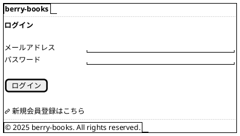
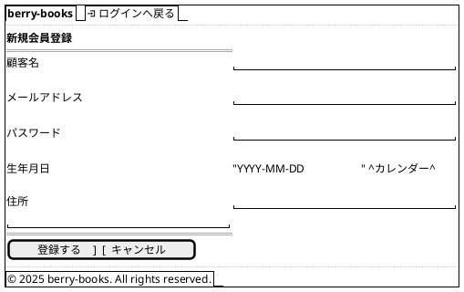
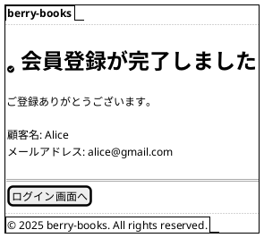

# F-004: 顧客管理・認証 - 画面設計書

**機能ID:** F-004  
**機能名:** 顧客管理・認証  
**バージョン:** 1.0.0  
**最終更新日:** 2025-12-16  
**フォーマット:** PlantUML (draw.io インポート可能)

---

## 画面一覧

1. [ログイン画面 (index.xhtml)](#1-ログイン画面)
2. [新規登録画面 (customerInput.xhtml)](#2-新規登録画面)
3. [登録完了画面 (customerOutput.xhtml)](#3-登録完了画面)

---

## 1. ログイン画面

**ファイル名:** `index.xhtml`  
**目的:** ユーザー認証

### PlantUML

### 画面項目定義

| 項目名 | 物理名 | 型 | 桁数 | 必須 | 入力チェック | エラーコード |
|--------|--------|-----|------|------|------------|-------------|
| メールアドレス | email | テキスト | 最大30 | ○ | Email形式 | VAL-001 |
| パスワード | password | パスワード | 最大60 | ○ | - | VAL-002 |

---

## 2. 新規登録画面

**ファイル名:** `customerInput.xhtml`  
**目的:** 新規顧客登録

### PlantUML

### 画面項目定義

| 項目名 | 物理名 | 型 | 桁数 | 必須 | 入力チェック | エラーコード |
|--------|--------|-----|------|------|------------|-------------|
| 顧客名 | customerName | テキスト | 最大30 | ○ | - | VAL-001 |
| メールアドレス | email | テキスト | 最大30 | ○ | Email形式、重複不可 | VAL-001, BIZ-001 |
| パスワード | password | パスワード | 最大60 | ○ | - | VAL-002 |
| 生年月日 | birthday | 日付 | - | - | 日付形式(YYYY-MM-DD) | - |
| 住所 | address | テキストエリア | 最大120 | - | - | - |

### 動作

- **登録ボタン**: CustomerBean.register() → customerOutput.xhtml
- **キャンセルボタン**: index.xhtmlへ戻る

---

## 3. 登録完了画面

**ファイル名:** `customerOutput.xhtml`  
**目的:** 登録完了通知

### PlantUML

