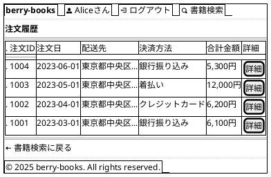
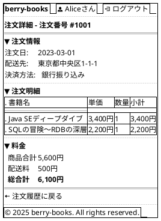

# F-005: 注文履歴参照 - 画面設計書

**機能ID:** F-005  
**機能名:** 注文履歴参照  
**バージョン:** 1.0.0  
**最終更新日:** 2025-12-16  
**フォーマット:** PlantUML (draw.io インポート可能)

---

## 画面一覧

1. [注文履歴画面 (orderHistory.xhtml)](#1-注文履歴画面)
2. [注文詳細画面 (orderDetail.xhtml)](#2-注文詳細画面)

---

## 1. 注文履歴画面

**ファイル名:** `orderHistory.xhtml`  
**目的:** 過去の注文一覧表示

### PlantUML

### レイアウト説明

| カラム | 説明 |
|--------|------|
| 注文ID | 注文取引ID |
| 注文日 | 注文確定日 |
| 配送先 | 配送先住所（省略表示） |
| 決済方法 | 銀行振込/クレジット/着払い |
| 合計金額 | 商品合計 + 配送料 |
| 詳細 | 注文詳細ボタン → orderDetail.xhtml |

### 動作

- **詳細ボタン**: orderDetail.xhtml?orderId=XXX へ遷移
- ソート順: 注文日降順（新しい順）

---

## 2. 注文詳細画面

**ファイル名:** `orderDetail.xhtml`  
**目的:** 注文の詳細情報表示

### PlantUML

