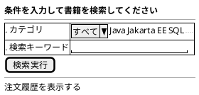
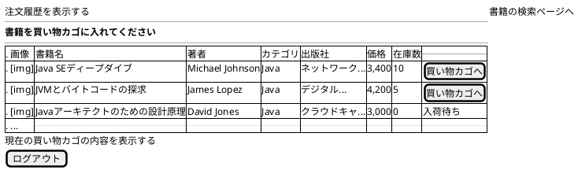

# F-001: 書籍検索・閲覧 - 画面設計書

**機能ID:** F-001  
**機能名:** 書籍検索・閲覧  
**バージョン:** 1.0.0  
**最終更新日:** 2025-12-16  
**フォーマット:** PlantUML (draw.io インポート可能)

---

## 画面一覧

1. [書籍検索画面 (bookSearch.xhtml)](#1-書籍検索画面)
2. [検索結果画面 (bookSelect.xhtml)](#2-検索結果画面)

---

## 1. 書籍検索画面

**ファイル名:** `bookSearch.xhtml`  
**目的:** 書籍検索条件入力

### PlantUML



### レイアウト説明

| エリア | コンポーネント | 説明 |
|--------|--------------|------|
| タイトル | h2 | "条件を入力して書籍を検索してください" |
| 検索フォーム | カテゴリドロップダウン | `bookSearchBean.searchParam.categoryId`にバインド。`bookSearchBean.categoryList`から生成 |
| | キーワード入力 | `bookSearchBean.searchParam.keyword`にバインド |
| | 検索実行ボタン | `bookSearchBean.search()` を呼び出し |
| ナビゲーション | 注文履歴を表示する | orderHistory.xhtmlへ |

### 検索ロジック

**検索実行ボタン**: `BookSearchBean.search()`
- `SearchParam`オブジェクトから検索条件を取得
- `BookService.searchBook(SearchParam)`を使用
- カテゴリIDとキーワードの組み合わせで検索
- 結果は`bookList`プロパティに格納
- bookSelect画面へリダイレクト（`faces-redirect=true`）

検索条件:
```
IF カテゴリ選択 AND キーワード入力
  → カテゴリ + キーワード複合検索（LIKEで部分一致）
ELSE IF カテゴリ選択のみ
  → カテゴリ検索
ELSE IF キーワード入力のみ
  → キーワード検索（書籍名のLIKE検索）
ELSE
  → 全書籍取得
```

---

## 2. 検索結果画面

**ファイル名:** `bookSelect.xhtml`  
**目的:** 検索結果一覧表示とカート追加

### PlantUML



### レイアウト説明

| カラム | 説明 |
|--------|------|
| 画像 | 書籍カバー画像（サムネイル） |
| 書籍名 | 書籍タイトル |
| 著者 | 著者名 |
| カテゴリ | カテゴリ名 |
| 出版社 | 出版社名 |
| 価格 | カンマ区切りで表示 |
| 在庫数 | 在庫数 |
| 操作 | 「買い物カゴへ」ボタンまたは「入荷待ち」テキスト |

### 画像表示ルール

- **画像リソース配置**: `webapp/resources/images/covers/`ディレクトリ
- **画像ファイル名**: 書籍名（BOOK_NAME）のスペースをアンダースコアに置換し、拡張子 `.jpg` を付加
  - 例: `Java SEディープダイブ` → `Java_SEディープダイブ.jpg`
- **画像パス**: `library="images" name="covers/#{book.bookName.replace(' ', '_')}.jpg"`
- **サイズ**: 
  - CSSクラス: `.book-thumbnail`（`styleClass="book-thumbnail"`で指定）
  - 高さ: `5cm`（幅は自動調整、アスペクト比維持）
  - 最大幅: `100%`（セル幅を超えない）
- **画像セル**: 
  - CSSクラス: `.book-image-cell`
  - 中央配置、垂直方向も中央
  - パディング: 8px
- **画像なし**: ファイルが存在しない場合、JavaScriptのonErrorで`no-image.jpg`を表示
  - `onError="this.onerror=null; this.src='#{request.contextPath}/jakarta.faces.resource/no-image.jpg?ln=images/covers'"`
- **Alt属性**: 書籍名を設定
- **スタイル**: 角丸（4px）、シャドウ付き、ホバー時に拡大・シャドウ強調

### 動作

- **画面初期化（preRenderViewイベント）**: `BookSearchBean.refreshBookList()` 
  - ページレンダリング前に書籍リストを最新の状態に更新
  - 在庫数を最新化（他のユーザーの購入により在庫が減っている可能性があるため）
  - `<f:metadata><f:event type="preRenderView" listener="#{bookSearchBean.refreshBookList}" /></f:metadata>`で実装
- **買い物カゴへボタン**: `CartBean.addBook(book.bookId, 1)` → cartView.xhtmlへリダイレクト
  - 在庫バージョン番号を保存してカートに追加（BR-012）
  - 既存の書籍を追加する場合、数量を加算（BR-011）
- **在庫なし**: ボタンの代わりに「入荷待ち」テキストを表示（`rendered="#{book.quantity == 0}"`）
- **現在の買い物カゴの内容を表示する**: cartView.xhtmlへ遷移（h:link）
- **ログアウトボタン**: `LoginBean.processLogout()` → index.xhtmlへ遷移

---

## 3. 実装のポイント

- **書籍一覧の表示**: `<ui:repeat>`を使用してテーブル形式で表示
- **在庫管理**: 在庫が0の場合、ボタンの代わりに「入荷待ち」テキストを表示
- **画像の動的生成**: 書籍名から画像ファイル名を生成し、存在しない場合はフォールバック画像を表示
- **複数の履歴表示方式**: 注文履歴は3つの異なる実装方式（方式1、2、3）をサポート

