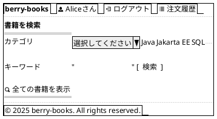
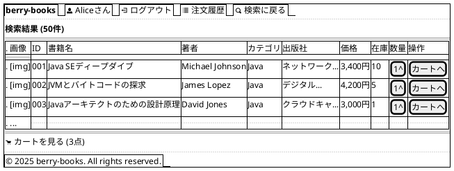

# F-001: 書籍検索・閲覧 - 画面設計書

**機能ID:** F-001  
**機能名:** 書籍検索・閲覧  
**バージョン:** 1.0.0  
**最終更新日:** 2025-12-16  
**フォーマット:** PlantUML (draw.io インポート可能)

---

## 画面一覧

1. [書籍検索画面 (bookSearch.xhtml)](#1-書籍検索画面)
2. [検索結果画面 (bookSelect.xhtml)](#2-検索結果画面)

---

## 1. 書籍検索画面

**ファイル名:** `bookSearch.xhtml`  
**目的:** 書籍検索条件入力

### PlantUML



### レイアウト説明

| エリア | コンポーネント | 説明 |
|--------|--------------|------|
| ヘッダー | サイト名 | "berry-books" |
| | ユーザー名 | ログイン中の顧客名 |
| | ログアウトリンク | セッション破棄 |
| | 注文履歴リンク | orderHistory.xhtmlへ |
| 検索フォーム | カテゴリドロップダウン | 全カテゴリ + 未選択 |
| | キーワード入力 | 書籍名・著者名検索 |
| | 検索ボタン | bookSelect.xhtmlへ |
| | 全書籍表示リンク | 検索条件なしで全表示 |

### 検索ロジック

```
IF カテゴリ選択 AND キーワード入力
  → カテゴリ + キーワード複合検索
ELSE IF カテゴリ選択のみ
  → カテゴリ検索
ELSE IF キーワード入力のみ
  → キーワード検索
ELSE
  → 全書籍取得
```

---

## 2. 検索結果画面

**ファイル名:** `bookSelect.xhtml`  
**目的:** 検索結果一覧表示とカート追加

### PlantUML



### レイアウト説明

| カラム | 説明 | 幅 |
|--------|------|-----|
| 画像 | 書籍カバー画像（サムネイル） | 固定80px |
| ID | 書籍ID | 固定50px |
| 書籍名 | 書籍タイトル | 可変 |
| 著者 | 著者名 | 150px |
| カテゴリ | カテゴリ名 | 100px |
| 出版社 | 出版社名（省略表示） | 150px |
| 価格 | カンマ区切り | 80px |
| 在庫 | 在庫数 | 50px |
| 数量 | スピナー入力 | 60px |
| 操作 | カート追加ボタン | 100px |

### 画像表示ルール

- **画像ファイル名**: 書籍名（BOOK_NAME）をそのまま使用し、拡張子 `.jpg` を付加
  - 例: `Java SEディープダイブ` → `Java SEディープダイブ.jpg`
- **画像パス**: `resources/covers/#{book.imageFileName}`
  - BookエンティティのgetImageFileName()メソッドで書籍名 + ".jpg" を返す
- **サイズ**: サムネイル表示（最大幅80px、高さ自動調整）
- **画像なし**: ファイルが存在しない場合、`no-image.jpg`を表示
- **Alt属性**: 書籍名を設定

### 動作

- **カートへボタン**: CartBean.addBook(bookId, count) → cartView.xhtml
- **在庫なし**: ボタン無効化、グレー表示
- **カートを見るリンク**: cartView.xhtmlへ遷移

---

## 3. カラースキーム

| 要素 | カラーコード | 用途 |
|------|------------|------|
| プライマリー | #CF3F4E | ボタン、リンク、ヘッダー |
| セカンダリー | #E8E8E8 | 背景、ボーダー |
| テキスト | #333333 | 本文 |
| エラー | #D32F2F | エラーメッセージ |
| 成功 | #388E3C | 成功メッセージ |

