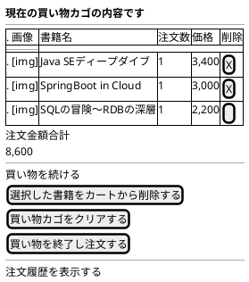

# F-002: ショッピングカート管理 - 画面設計書

**機能ID:** F-002  
**機能名:** ショッピングカート管理  
**バージョン:** 1.0.0  
**最終更新日:** 2025-12-16  
**フォーマット:** PlantUML (draw.io インポート可能)

---

## 画面一覧

1. [カート確認画面 (cartView.xhtml)](#1-カート確認画面)

---

## 1. カート確認画面

**ファイル名:** `cartView.xhtml`  
**目的:** カート内容確認・編集

### PlantUML

### レイアウト説明

| エリア | コンポーネント | 説明 |
|--------|--------------|------|
| タイトル | h2 | "現在の買い物カゴの内容です" |
| カートテーブル | 画像 | 書籍カバー画像（サムネイル） |
| | 書籍名 | `cartItem.bookName` |
| | 注文数 | `cartItem.count` |
| | 価格 | `cartItem.price`（カンマ区切り） |
| | 削除チェックボックス | `cartItem.remove`にバインド |
| 価格表示 | 注文金額合計 | `cartSession.totalPrice` |
| 操作ボタン | 選択した書籍をカートから削除する | `cartBean.removeSelectedBooks()` |
| | 買い物カゴをクリアする | `cartBean.clearCart()` |
| | 買い物を終了し注文する | `cartBean.proceedToOrder()` |
| ナビゲーション | 買い物を続ける | bookSelect.xhtmlへ |
| | 注文履歴を表示する | orderHistory.xhtmlへ |

### 画像表示ルール

- **画像リソース配置**: `webapp/resources/images/covers/`ディレクトリ
- **画像ファイル名**: 書籍名（BOOK_NAME）のスペースをアンダースコアに置換し、拡張子 `.jpg` を付加
  - 例: `Java SEディープダイブ` → `Java_SEディープダイブ.jpg`
- **画像パス**: `library="images" name="covers/#{cartItem.bookName.replace(' ', '_')}.jpg"`
- **サイズ**: 
  - CSSクラス: `.book-thumbnail`（`styleClass="book-thumbnail"`で指定）
  - 高さ: `5cm`（幅は自動調整、アスペクト比維持）
  - 最大幅: `100%`（セル幅を超えない）
- **画像セル**: 
  - CSSクラス: `.book-image-cell`
  - 中央配置、垂直方向も中央
  - パディング: 8px
- **画像なし**: ファイルが存在しない場合、JavaScriptのonErrorで`no-image.jpg`を表示
  - `onError="this.onerror=null; this.src='#{request.contextPath}/jakarta.faces.resource/no-image.jpg?ln=images/covers'"`
- **Alt属性**: 書籍名を設定
- **スタイル**: 角丸（4px）、シャドウ付き、ホバー時に拡大・シャドウ強調

### 動作

- **画面表示時のエラー処理**: 
  - カートが空の場合、`CartBean.globalErrorMessage`にエラーメッセージを設定
  - エラーメッセージが存在する場合、カート内容の代わりにエラーメッセージと「書籍の選択ページへ戻る」リンクを表示
  - `h:panelGroup rendered="#{not empty cartBean.globalErrorMessage}"`で条件付き表示
- **書籍選択画面からの遷移**: 
  - `bookSelect.xhtml`から`CartBean.addBook(bookId, 1)`が呼び出される
  - 在庫バージョン番号を保存してカートに追加（BR-012）
  - 既存の書籍を追加する場合、数量を加算（BR-011）
  - `cartView.xhtml`へリダイレクト
- **選択した書籍をカートから削除する**: `CartBean.removeSelectedBooks()` → 画面をリフレッシュ（nullを返す）
- **買い物カゴをクリアする**: `CartBean.clearCart()` → cartClear.xhtmlへ遷移
- **買い物を終了し注文する**: `CartBean.proceedToOrder()` → bookOrder.xhtmlへ遷移
  - 配送先住所を顧客住所から設定（`CartSession.deliveryAddress`）
  - 配送料金を計算（`DeliveryFeeService`を使用）
  - カートが空の場合はnullを返し、同じページに留まる
- **買い物を続ける**: bookSelect.xhtmlへ遷移

