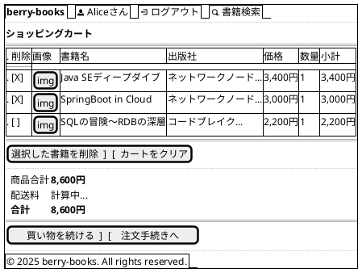

# F-002: ショッピングカート管理 - 画面設計書

**機能ID:** F-002  
**機能名:** ショッピングカート管理  
**バージョン:** 1.0.0  
**最終更新日:** 2025-12-16  
**フォーマット:** PlantUML (draw.io インポート可能)

---

## 画面一覧

1. [カート確認画面 (cartView.xhtml)](#1-カート確認画面)

---

## 1. カート確認画面

**ファイル名:** `cartView.xhtml`  
**目的:** カート内容確認・編集

### PlantUML

### レイアウト説明

| エリア | コンポーネント | 説明 |
|--------|--------------|------|
| カートテーブル | 削除チェックボックス | 複数選択可能 |
| | 画像 | 書籍カバー画像（サムネイル60px） |
| | 書籍情報 | 書籍名、出版社、価格 |
| | 数量 | 表示のみ（変更不可） |
| | 小計 | 単価 × 数量 |
| 操作ボタン | 選択削除 | チェックした書籍を削除 |
| | カートクリア | 全削除 |
| 価格サマリー | 商品合計 | カート内商品の合計 |
| | 配送料 | 注文手続き時に計算 |
| | 合計 | 商品合計 + 配送料 |
| ナビゲーション | 買い物を続ける | bookSearch.xhtmlへ |
| | 注文手続きへ | bookOrder.xhtmlへ |

### 画像表示ルール

- **画像ファイル名**: 書籍名（BOOK_NAME）+ ".jpg"
  - 例: `Java SEディープダイブ` → `Java SEディープダイブ.jpg`
- **画像パス**: `resources/covers/#{book.imageFileName}`
  - BookエンティティのgetImageFileName()メソッドで生成
- **サイズ**: サムネイル表示（最大幅60px、高さ自動調整）
- **画像なし**: ファイルが存在しない場合、`no-image.jpg`を表示
- **Alt属性**: 書籍名を設定

### 動作

- **選択削除**: CartBean.removeSelectedBooks() → 再表示
- **カートクリア**: CartBean.clearCart() → cartClear.xhtml
- **注文手続きへ**: CartBean.proceedToOrder() → bookOrder.xhtml
  - 配送先住所を顧客住所から設定
  - 配送料金を計算

