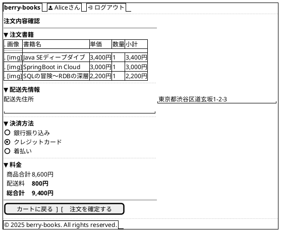
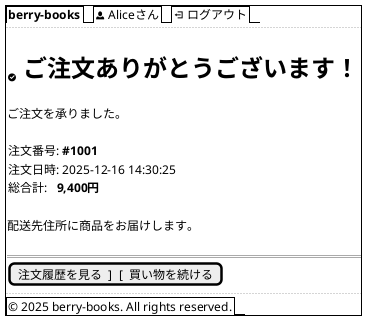
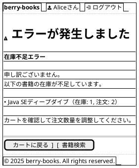

# F-003: 注文処理 - 画面設計書

**機能ID:** F-003  
**機能名:** 注文処理  
**バージョン:** 1.0.0  
**最終更新日:** 2025-12-16  
**フォーマット:** PlantUML (draw.io インポート可能)

---

## 画面一覧

1. [注文入力画面 (bookOrder.xhtml)](#1-注文入力画面)
2. [注文完了画面 (orderSuccess.xhtml)](#2-注文完了画面)
3. [注文エラー画面 (orderError.xhtml)](#3-注文エラー画面)

---

## 1. 注文入力画面

**ファイル名:** `bookOrder.xhtml`  
**目的:** 配送先・決済方法入力

### PlantUML



### 画像表示ルール

- **画像ファイル名**: 書籍名（BOOK_NAME）+ ".jpg"
  - 例: `Java SEディープダイブ` → `Java SEディープダイブ.jpg`
- **画像パス**: `resources/covers/#{book.imageFileName}`
  - BookエンティティのgetImageFileName()メソッドで生成
- **サイズ**: サムネイル表示（最大幅60px、高さ自動調整）
- **画像なし**: ファイルが存在しない場合、`no-image.jpg`を表示
- **Alt属性**: 書籍名を設定

### 配送料金計算ルール

```
IF 商品合計 >= 5,000円
  → 配送料 = 0円（送料無料）
ELSE IF 配送先住所 が "沖縄県" で始まる
  → 配送料 = 1,700円
ELSE
  → 配送料 = 800円
```

### 動作

- **カートに戻る**: cartView.xhtmlへ遷移
- **注文を確定する**: OrderBean.placeOrder()
  - 成功 → orderSuccess.xhtml
  - 在庫不足 → エラーメッセージ表示、同画面に留まる
  - 楽観的ロック競合 → エラーメッセージ表示

---

## 2. 注文完了画面

**ファイル名:** `orderSuccess.xhtml`  
**目的:** 注文確定完了通知

### PlantUML



---

## 3. 注文エラー画面

**ファイル名:** `orderError.xhtml`  
**目的:** 注文エラー表示

### PlantUML



### エラーメッセージパターン

| エラー種別 | メッセージ |
|----------|----------|
| 在庫不足 | "在庫が不足しています。書籍名（在庫: X, 注文: Y）" |
| 楽観的ロック競合 | "他のユーザーが同時に購入しました。カートを確認してください。" |
| 空カート | "カートに商品がありません。" |

