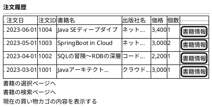
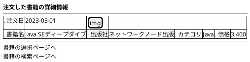

# F-005: 注文履歴参照 - 画面設計書

**機能ID:** F-005  
**機能名:** 注文履歴参照  
**バージョン:** 1.0.0  
**最終更新日:** 2025-12-16  
**フォーマット:** PlantUML (draw.io インポート可能)

---

## 画面一覧

1. [注文履歴画面 (orderHistory.xhtml)](#1-注文履歴画面)
2. [注文詳細画面 (orderDetail.xhtml)](#2-注文詳細画面)

---

## 1. 注文履歴画面

**ファイル名:** `orderHistory.xhtml`  
**目的:** 過去の注文一覧表示

### PlantUML

### レイアウト説明

| カラム | 説明 |
|--------|------|
| 注文日 | 注文確定日（`orderHistory.orderDate()`） |
| 注文ID | 注文取引ID（`orderHistory.tranId()`） |
| 書籍名 | 購入した書籍名（`orderHistory.bookName()`） |
| 出版社名 | 出版社名（`orderHistory.publisherName()`） |
| 価格 | 書籍価格（`orderHistory.price()`） |
| 個数 | 購入数量（`orderHistory.count()`） |
| 書籍情報 | orderDetail.xhtmlへのリンク（tranIdとdetailIdを渡す） |

### 動作

- **書籍情報リンク**: orderDetail.xhtmlへ遷移
  - URLパラメータ: `tranId`（注文取引ID）、`detailId`（注文明細ID）
  - 例: `orderDetail.xhtml?tranId=1001&detailId=1`
- **初期表示**: `OrderHistoryBean.loadOrderHistory()` をビューアクション（`<f:viewAction>`）で実行
- ソート順: 注文日降順（新しい順）

---

## 2. 注文詳細画面

**ファイル名:** `orderDetail.xhtml`  
**目的:** 注文の詳細情報表示

### 画像表示ルール（注文詳細画面のみ）

- **画像リソース配置**: `webapp/resources/images/covers/`ディレクトリ
- **画像ファイル名**: 書籍名（BOOK_NAME）のスペースをアンダースコアに置換し、拡張子 `.jpg` を付加
  - 例: `Java SEディープダイブ` → `Java_SEディープダイブ.jpg`
- **画像パス**: `library="images" name="covers/#{orderHistoryBean.orderSummary.orderDetails[0].book.bookName.replace(' ', '_')}.jpg"`
- **サイズ**: 
  - CSSクラス: `.book-thumbnail`（`styleClass="book-thumbnail"`で指定）
  - 高さ: `5cm`（幅は自動調整、アスペクト比維持）
  - 最大幅: `100%`（セル幅を超えない）
- **画像セル**: 
  - CSSクラス: `.book-image-cell`（注文詳細テーブルでは`.order-detail-table .book-image-cell`）
  - 中央配置、垂直方向も中央
  - 幅: 35%（注文詳細テーブル）
- **画像なし**: ファイルが存在しない場合、JavaScriptのonErrorで`no-image.jpg`を表示
  - `onError="this.onerror=null; this.src='#{request.contextPath}/jakarta.faces.resource/no-image.jpg?ln=images/covers'"`
- **Alt属性**: 書籍名を設定
- **スタイル**: 角丸（4px）、シャドウ付き、ホバー時に拡大・シャドウ強調

### PlantUML

