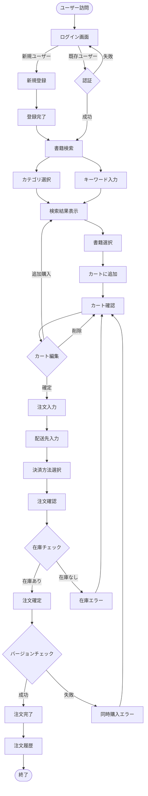
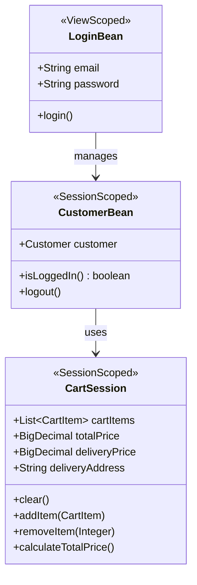

# berry-books - 機能設計書（概要）

**プロジェクトID:** berry-books  
**バージョン:** 1.1.0  
**最終更新日:** 2025-12-16  
**ステータス:** 機能設計完了

---

## 1. 概要

本文書は、berry-booksシステムの機能設計の概要を記述します。各機能の詳細設計は、機能ごとに分割されたドキュメントを参照してください。

**関連ドキュメント:**
- [requirements.md](requirements.md) - 要件定義書
- [architecture_design.md](architecture_design.md) - アーキテクチャ設計書
- [data_model.md](data_model.md) - データモデル
- [screen_design.md](screen_design.md) - 画面設計書（概要）
- [behaviors.md](behaviors.md) - 振る舞い仕様書（概要）

---

## 2. 機能一覧

| 機能ID | 機能名 | 説明 | 詳細ドキュメント |
|--------|--------|------|-----------------|
| F-001 | 書籍検索・閲覧 | カテゴリやキーワードで書籍を検索し、一覧表示する | [../features/F-001-book-search/functional_design.md](../features/F-001-book-search/functional_design.md) |
| F-002 | ショッピングカート管理 | 選択した書籍をカートに追加・管理する | [../features/F-002-shopping-cart/functional_design.md](../features/F-002-shopping-cart/functional_design.md) |
| F-003 | 注文処理 | カート内の書籍を購入し、配送先と決済方法を指定する | [../features/F-003-order-processing/functional_design.md](../features/F-003-order-processing/functional_design.md) |
| F-004 | 顧客管理・認証 | アカウントを登録してログインする | [../features/F-004-customer-auth/functional_design.md](../features/F-004-customer-auth/functional_design.md) |
| F-005 | 注文履歴参照 | 過去の注文履歴を確認する | [../features/F-005-order-history/functional_design.md](../features/F-005-order-history/functional_design.md) |

---

## 3. 主要ビジネスルール

### 3.1 書籍検索・閲覧（F-001）

| ルールID | 説明 |
|---------|-------------|
| BR-001 | カテゴリ未選択の場合、全カテゴリが検索対象 |
| BR-002 | キーワード未入力の場合、書籍名と著者の両方を検索 |
| BR-003 | 検索結果は書籍ID昇順でソート |
| BR-004 | 在庫0の書籍も表示（購入不可） |

### 3.2 ショッピングカート管理（F-002）

| ルールID | 説明 |
|---------|-------------|
| BR-010 | カート内容はセッション単位で保持（ログアウトまで） |
| BR-011 | 同じ書籍を追加した場合、数量を加算 |
| BR-012 | カート追加時点の在庫バージョン番号を保存（楽観的ロック用） |
| BR-013 | カート内の合計金額は常に自動計算 |

### 3.3 注文処理（F-003）

| ルールID | 説明 | 詳細 |
|---------|-------------|---------|
| BR-020 | 配送料金計算ルール | 通常800円、沖縄県1700円、購入金額5000円以上で送料無料 |
| BR-021 | 決済方法選択肢 | 銀行振込、クレジットカード、着払い |
| BR-022 | 在庫チェックタイミング | 注文確定時に全書籍の在庫を確認 |
| BR-023 | 在庫減算タイミング | 在庫チェック後、注文登録前に減算 |
| BR-024 | 楽観的ロック制御 | カート追加時のバージョン番号で在庫更新 |
| BR-025 | トランザクション範囲 | 在庫チェック〜注文登録〜在庫減算は単一トランザクション |

### 3.4 顧客管理・認証（F-004）

| ルールID | 説明 |
|---------|-------------|
| BR-030 | メールアドレスは一意（重複不可） |
| BR-031 | パスワードは平文保存（学習用のみ、本番環境では非推奨） |
| BR-032 | セッションタイムアウト: 60分 |
| BR-033 | 公開ページ: ログイン画面、新規登録画面、登録完了画面 |
| BR-034 | 公開ページ以外は認証必須 |

### 3.5 注文履歴参照（F-005）

| ルールID | 説明 |
|---------|-------------|
| BR-040 | 注文履歴は顧客IDでフィルタリング |
| BR-041 | 注文日降順（新しい順）でソート |
| BR-042 | 注文詳細は注文IDで取得 |

---

## 4. ユーザーフロー

### 4.1 メインユーザーフロー: 書籍購入フロー

---

## 5. クラス設計概要

### 5.1 主要クラスの責務

本システムの主要クラスとその責務を以下に示します。

#### 5.1.1 共通ユーティリティ (common/)

**MessageUtil**
- **責務**: メッセージリソース（messages.properties）からメッセージを取得
- **タイプ**: ユーティリティクラス（final、static メソッド）

**SettlementType**
- **責務**: 決済方法を表す定数とユーティリティメソッドを提供
- **タイプ**: Enum（列挙型）
- **定数**: BANK_TRANSFER(1), CREDIT_CARD(2), CASH_ON_DELIVERY(3)

#### 5.1.2 プレゼンテーション層 (web/)

各機能のManagedBeanとDTOクラス。詳細は各機能のドキュメントを参照。

#### 5.1.3 ビジネスロジック層 (service/)

各機能のServiceクラス。詳細は各機能のドキュメントを参照。

#### 5.1.4 データアクセス層 (dao/)

各機能のDaoクラス。詳細は各機能のドキュメントを参照。

---

## 6. セッション状態設計

セッションスコープで管理される主要なBeanの構造を以下に示します。

---

## 7. バッチ処理

**該当なし**

本プロジェクト（berry-books）では、バッチ処理の要件は存在しない。全ての処理はオンラインのWebリクエストで実行される。

**補足:**
- 将来的に定期的なデータクリーンアップやレポート生成が必要になった場合は、本セクションにバッチ処理の設計を追加する。

---

## 8. 機能別詳細ドキュメント

各機能の詳細設計は、以下のドキュメントを参照してください。

### F-001: 書籍検索・閲覧
- [機能設計](../features/F-001-book-search/functional_design.md)
- [画面設計](../features/F-001-book-search/screen_design.md)
- [振る舞い仕様](../features/F-001-book-search/behaviors.md)

### F-002: ショッピングカート管理
- [機能設計](../features/F-002-shopping-cart/functional_design.md)
- [画面設計](../features/F-002-shopping-cart/screen_design.md)
- [振る舞い仕様](../features/F-002-shopping-cart/behaviors.md)

### F-003: 注文処理
- [機能設計](../features/F-003-order-processing/functional_design.md)
- [画面設計](../features/F-003-order-processing/screen_design.md)
- [振る舞い仕様](../features/F-003-order-processing/behaviors.md)

### F-004: 顧客管理・認証
- [機能設計](../features/F-004-customer-auth/functional_design.md)
- [画面設計](../features/F-004-customer-auth/screen_design.md)
- [振る舞い仕様](../features/F-004-customer-auth/behaviors.md)

### F-005: 注文履歴参照
- [機能設計](../features/F-005-order-history/functional_design.md)
- [画面設計](../features/F-005-order-history/screen_design.md)
- [振る舞い仕様](../features/F-005-order-history/behaviors.md)
