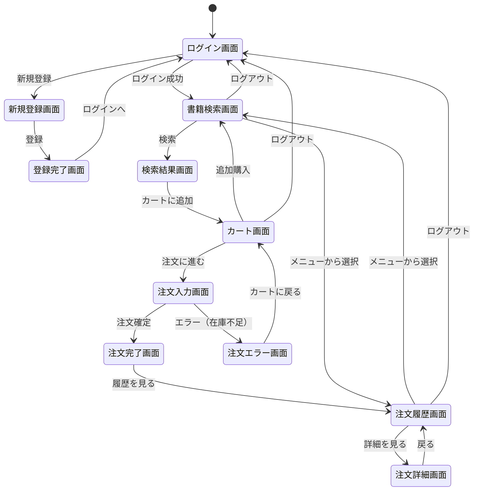
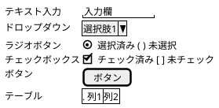

# berry-books - 画面仕様書

**プロジェクトID:** berry-books
**バージョン:** 1.1.0
**最終更新日:** 2025-12-16
**フォーマット:** PlantUML (draw.io インポート可能)

---

## 概要

本文書は、berry-booksシステムの画面設計の概要を記述します。各機能の詳細な画面設計は、機能ごとに分割されたドキュメントを参照してください。

**関連ドキュメント:**
- [requirements.md](requirements.md) - 要件定義書
- [functional_design.md](functional_design.md) - 機能設計書（概要）
- [behaviors.md](behaviors.md) - 振る舞い仕様書（概要）

---

## 画面一覧

| 画面ID | 画面名 | ファイル名 | 認証 | 機能ID | 詳細ドキュメント |
|--------|--------|-----------|------|--------|-----------------|
| SC-001 | ログイン画面 | index.xhtml | 不要 | F-004 | [../features/F_004_customer_auth/screen_design.md](../features/F_004_customer_auth/screen_design.md#1-ログイン画面) |
| SC-002 | 新規登録画面 | customerInput.xhtml | 不要 | F-004 | [../features/F_004_customer_auth/screen_design.md](../features/F_004_customer_auth/screen_design.md#2-新規登録画面) |
| SC-003 | 登録完了画面 | customerOutput.xhtml | 不要 | F-004 | [../features/F_004_customer_auth/screen_design.md](../features/F_004_customer_auth/screen_design.md#3-登録完了画面) |
| SC-004 | 書籍検索画面 | bookSearch.xhtml | 必要 | F-001 | [../features/F_001_book_search/screen_design.md](../features/F_001_book_search/screen_design.md#1-書籍検索画面) |
| SC-005 | 検索結果画面 | bookSelect.xhtml | 必要 | F-001 | [../features/F_001_book_search/screen_design.md](../features/F_001_book_search/screen_design.md#2-検索結果画面) |
| SC-006 | カート画面 | cartView.xhtml | 必要 | F-002 | [../features/F_002_shopping_cart/screen_design.md](../features/F_002_shopping_cart/screen_design.md#1-カート確認画面) |
| SC-007 | 注文入力画面 | bookOrder.xhtml | 必要 | F-003 | [../features/F_003_order_processing/screen_design.md](../features/F_003_order_processing/screen_design.md#1-注文入力画面) |
| SC-008 | 注文完了画面 | orderSuccess.xhtml | 必要 | F-003 | [../features/F_003_order_processing/screen_design.md](../features/F_003_order_processing/screen_design.md#2-注文完了画面) |
| SC-009 | 注文エラー画面 | orderError.xhtml | 必要 | F-003 | [../features/F_003_order_processing/screen_design.md](../features/F_003_order_processing/screen_design.md#3-注文エラー画面) |
| SC-010 | 注文履歴画面 | orderHistory.xhtml | 必要 | F-005 | [../features/F_005_order_history/screen_design.md](../features/F_005_order_history/screen_design.md#1-注文履歴画面) |
| SC-011 | 注文詳細画面 | orderDetail.xhtml | 必要 | F-005 | [../features/F_005_order_history/screen_design.md](../features/F_005_order_history/screen_design.md#2-注文詳細画面) |

---

## 画面遷移図

---

## 共通UI要素

### ヘッダーコンポーネント

### フッターコンポーネント

### カラースキーム

| 要素 | カラーコード | 用途 |
|------|------------|------|
| プライマリー | #CF3F4E | ボタン、リンク、ヘッダー |
| セカンダリー | #E8E8E8 | 背景、ボーダー |
| テキスト | #333333 | 本文 |
| エラー | #D32F2F | エラーメッセージ |
| 成功 | #388E3C | 成功メッセージ |
| 警告 | #F57C00 | 警告メッセージ |

---

## レスポンシブブレークポイント

| デバイス | ブレークポイント | レイアウト |
|---------|----------------|-----------|
| デスクトップ | > 1024px | 横幅最大1200px、中央寄せ |
| タブレット | 768px - 1024px | 横幅100%、パディング20px |
| モバイル | < 768px | スタック表示、横スクロール |

---

## アクセシビリティ要件

| 要件 | 実装 |
|------|------|
| キーボードナビゲーション | Tab順序の最適化 |
| スクリーンリーダー対応 | 適切なARIAラベル |
| コントラスト比 | WCAG AA準拠（4.5:1以上） |
| フォーカス表示 | 明確なアウトライン |

---

## 機能別画面詳細ドキュメント

各機能の詳細な画面設計は、以下のドキュメントを参照してください。

### F-001: 書籍検索・閲覧
- [画面設計](../features/F_001_book_search/screen_design.md)

### F-002: ショッピングカート管理
- [画面設計](../features/F_002_shopping_cart/screen_design.md)

### F-003: 注文処理
- [画面設計](../features/F_003_order_processing/screen_design.md)

### F-004: 顧客管理・認証
- [画面設計](../features/F_004_customer_auth/screen_design.md)

### F-005: 注文履歴参照
- [画面設計](../features/F_005_order_history/screen_design.md)

---

## 付録: PlantUML 参考情報

### salt記法の基本

