# berry-books - 技術実装計画

**Feature ID:** 001-berry-books  
**Version:** 1.0.0  
**Last Updated:** 2025-12-13  
**Status:** 技術設計完了

---

## 1. 技術スタック

### 1.1 コアプラットフォーム

| レイヤー | 技術 | バージョン | 選定理由 |
|-------|-----------|---------|-----------|
| **ランタイム** | JDK | 21 | LTSバージョン、最新のJava機能を使用可能 |
| **プラットフォーム** | Jakarta EE | 10.0 | Javaエンタープライズアプリケーションの標準 |
| **アプリサーバー** | Payara Server | 6.x | Jakarta EE 10完全準拠、本番環境対応 |
| **データベース** | HSQLDB | 2.7.x | 学習・開発用の組み込みデータベース |
| **ビルドツール** | Gradle | 8.x | マルチプロジェクト対応の最新ビルドツール |

### 1.2 Jakarta EE仕様

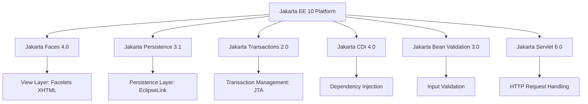

| 仕様 | バージョン | 目的 |
|--------------|---------|---------|
| Jakarta Faces (JSF) | 4.0 | MVC Webフレームワーク |
| Jakarta Persistence (JPA) | 3.1 | オブジェクト関係マッピング |
| Jakarta Transactions (JTA) | 2.0 | 分散トランザクション管理 |
| Jakarta CDI | 4.0 | 依存性注入とコンテキスト管理 |
| Jakarta Bean Validation | 3.0 | 入力検証フレームワーク |
| Jakarta Servlet | 6.0 | HTTPリクエスト/レスポンス処理 |

### 1.3 追加ライブラリ

| ライブラリ | 目的 | 選定理由 |
|---------|---------|-----------|
| SLF4J + Logback | ログ出力 | 業界標準のロギングファサード |
| JUnit 5 | ユニットテスト | 最新のテストフレームワーク |
| Mockito | モッキング | ユニットテストの独立性確保 |

---

## 2. アーキテクチャ設計

### 2.1 レイヤードアーキテクチャ

```mermaid
graph TB
    subgraph "Presentation Layer"
        View[JSF Facelets<br/>XHTML + CSS]
        Controller[Managed Beans<br/>@Named @ViewScoped<br/>@SessionScoped]
    end
    
    subgraph "Business Logic Layer"
        Service[Service Classes<br/>@ApplicationScoped<br/>@Transactional]
    end
    
    subgraph "Data Access Layer"
        DAO[DAO Classes<br/>@ApplicationScoped<br/>EntityManager]
    end
    
    subgraph "Persistence Layer"
        Entity[JPA Entities<br/>@Entity<br/>Relationships]
    end
    
    subgraph "Database Layer"
        DB[(HSQLDB<br/>testdb)]
    end
    
    View -->|User Input| Controller
    Controller -->|@Inject| Service
    Service -->|@Inject| DAO
    DAO -->|@PersistenceContext| Entity
    Entity -->|JDBC| DB
    
    Controller -->|Display Data| View
```

### 2.2 コンポーネントの責務

| レイヤー | 責務 | 禁止事項 |
|-------|-----------------|-------------------|
| **View (XHTML)** | • UIレンダリング<br/>• ユーザー入力の収集<br/>• 表示フォーマット | • ビジネスロジック<br/>• 直接データベースアクセス<br/>• 複雑な計算 |
| **Controller (Managed Bean)** | • リクエスト処理<br/>• ナビゲーション制御<br/>• 入力検証の表示<br/>• サービス委譲 | • 直接データベースアクセス<br/>• ビジネスルール実装<br/>• トランザクション管理 |
| **Service** | • ビジネスロジック<br/>• トランザクション境界<br/>• 複数DAOの連携<br/>• ビジネス検証 | • UI固有ロジック<br/>• 直接SQLクエリ<br/>• HTTPリクエスト処理 |
| **DAO** | • CRUD操作<br/>• クエリ実行<br/>• エンティティライフサイクル管理 | • ビジネスロジック<br/>• トランザクション制御<br/>• UI関連処理 |
| **Entity** | • データ構造<br/>• リレーションシップ<br/>• データベースマッピング | • ビジネスロジック<br/>• 検証ロジック（Bean Validationを使用） |

---

## 3. デザインパターン

### 3.1 適用パターン

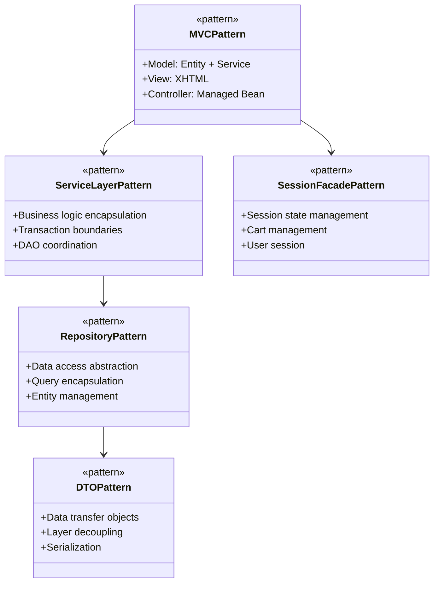

| パターン | 実装 | メリット |
|---------|---------------|---------|
| **MVC** | JSF + Managed Bean + Service | 関心事の分離 |
| **サービスレイヤー** | @ApplicationScoped Service クラス | ビジネスロジックの集約 |
| **リポジトリ (DAO)** | EntityManager を使用した DAO クラス | データアクセスの抽象化 |
| **DTO/転送オブジェクト** | OrderTO, OrderHistoryTO | レイヤー間の疎結合 |
| **セッションファサード** | @SessionScoped beans | セッション状態管理 |
| **依存性注入** | @Inject (CDI) | 疎結合化 |
| **楽観的ロック** | @Version (JPA) | 並行制御 |
| **トランザクションスクリプト** | @Transactional メソッド | トランザクション管理 |

---

## 4. データフローアーキテクチャ

### 4.1 書籍検索フロー

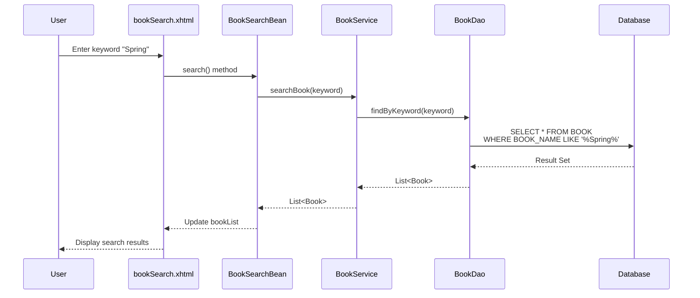

### 4.2 注文処理フロー（楽観的ロック付き）

```mermaid
sequenceDiagram
    participant User as User
    participant Bean as OrderBean
    participant Service as OrderService
    participant StockDAO as StockDao
    participant OrderDAO as OrderTranDao
    participant DB as Database
    
    User->>Bean: Click "Place Order"
    Bean->>Service: orderBooks(OrderTO)
    
    Note over Service: @Transactional START
    
    Service->>StockDAO: findById(bookId)
    StockDAO->>DB: SELECT * FROM STOCK
    DB-->>StockDAO: Current stock (VERSION=2)
    StockDAO-->>Service: Stock entity
    
    alt Stock Check
        Service->>Service: Check if quantity >= order count
        Service-->>Service: ✓ OK
    else Insufficient Stock
        Service-->>Bean: throw OutOfStockException
        Bean-->>User: Error: "在庫不足です"
    end
    
    Service->>StockDAO: update(Stock with VERSION=1)
    StockDAO->>DB: UPDATE STOCK<br/>SET QUANTITY = ?<br/>WHERE BOOK_ID = ?<br/>AND VERSION = 1
    
    alt Version Match
        DB-->>StockDAO: 1 row updated
        Service->>OrderDAO: persist(OrderTran)
        OrderDAO->>DB: INSERT INTO ORDER_TRAN
        Service->>OrderDAO: persist(OrderDetail)
        OrderDAO->>DB: INSERT INTO ORDER_DETAIL
        
        Note over Service: @Transactional COMMIT
        
        Service-->>Bean: OrderTran (success)
        Bean-->>User: Navigate to success page
    else Version Mismatch
        DB-->>StockDAO: 0 rows updated
        StockDAO-->>Service: OptimisticLockException
        
        Note over Service: @Transactional ROLLBACK
        
        Service-->>Bean: throw exception
        Bean-->>User: Error: "他のユーザーが購入済み"
    end
```

---

## 5. パッケージ構造

### 5.1 パッケージ編成

```
pro.kensait.berrybooks/
├── common/                      # Common utilities and constants
│   ├── MessageUtil              # Message resource utility
│   └── SettlementType          # Payment method enum
│
├── util/                        # General utilities
│   └── AddressUtil             # Address handling utility
│
├── web/                         # Presentation layer (JSF Managed Beans)
│   ├── book/
│   │   ├── BookSearchBean      # Book search controller
│   │   └── SearchParam         # Search parameter holder
│   ├── cart/
│   │   ├── CartBean            # Shopping cart controller
│   │   ├── CartItem            # Cart item DTO
│   │   └── CartSession         # Cart session facade
│   ├── order/
│   │   └── OrderBean           # Order processing controller
│   ├── customer/
│   │   └── CustomerBean        # Customer management controller
│   ├── login/
│   │   └── LoginBean           # Login controller
│   └── filter/
│       └── AuthenticationFilter # Authentication filter
│
├── service/                     # Business logic layer
│   ├── book/
│   │   └── BookService         # Book business logic
│   ├── category/
│   │   └── CategoryService     # Category management
│   ├── customer/
│   │   ├── CustomerService     # Customer management
│   │   └── EmailAlreadyExistsException
│   ├── delivery/
│   │   └── DeliveryFeeService  # Delivery fee calculation
│   └── order/
│       ├── OrderService        # Order processing
│       ├── OrderServiceIF      # Order service interface
│       ├── OrderTO             # Order transfer object
│       ├── OrderHistoryTO      # Order history DTO
│       ├── OrderSummaryTO      # Order summary DTO
│       └── OutOfStockException # Out of stock exception
│
├── dao/                         # Data access layer
│   ├── BookDao                 # Book data access
│   ├── CategoryDao             # Category data access
│   ├── CustomerDao             # Customer data access
│   ├── StockDao                # Stock data access
│   ├── OrderTranDao            # Order transaction data access
│   └── OrderDetailDao          # Order detail data access
│
└── entity/                      # Persistence layer (JPA entities)
    ├── Book                    # Book entity
    ├── Category                # Category entity
    ├── Publisher               # Publisher entity
    ├── Stock                   # Stock entity (with @Version)
    ├── Customer                # Customer entity
    ├── OrderTran               # Order transaction entity
    ├── OrderDetail             # Order detail entity
    └── OrderDetailPK           # Order detail composite key
```

### 5.2 命名規則

| コンポーネントタイプ | パターン | 例 |
|---------------|---------|---------|
| Entity | PascalCase 名詞 | `Book`, `OrderTran` |
| DAO | EntityName + Dao | `BookDao`, `StockDao` |
| Service | EntityName + Service | `BookService`, `OrderService` |
| Managed Bean | FeatureName + Bean | `BookSearchBean`, `CartBean` |
| DTO/TO | Purpose + TO | `OrderTO`, `OrderHistoryTO` |
| Exception | ErrorType + Exception | `OutOfStockException` |
| Enum | PascalCase | `SettlementType` |
| Utility | FeatureName + Util | `MessageUtil`, `AddressUtil` |

### 5.3 主要クラスの責務

#### 共通ユーティリティ (common/)

**MessageUtil**
- **責務**: メッセージリソース（messages.properties）からメッセージを取得
- **タイプ**: ユーティリティクラス（final、static メソッド）
- **主要メソッド**: `get(String key)`, `get(String key, Object... params)`

**SettlementType**
- **責務**: 決済方法を表す定数とユーティリティメソッドを提供
- **タイプ**: Enum（列挙型）
- **定数**: BANK_TRANSFER(1), CREDIT_CARD(2), CASH_ON_DELIVERY(3)
- **主要メソッド**: `fromCode(Integer)`, `getDisplayNameByCode(Integer)`, `getAllCodes()`

#### プレゼンテーション層 (web/)

**SearchParam**
- **責務**: 書籍検索パラメータを保持
- **タイプ**: DTOクラス（Data Transfer Object）
- **フィールド**: categoryId, keyword

**CartItem**
- **責務**: カート内の書籍情報を保持
- **タイプ**: DTOクラス（Serializable）
- **フィールド**: bookId, bookName, publisherName, price, count, version, removeフラグ

**CartSession**
- **責務**: セッションスコープでカート状態を管理
- **タイプ**: @SessionScoped Bean
- **フィールド**: cartItems, totalPrice, deliveryPrice, deliveryAddress

#### ビジネスロジック層 (service/)

**OrderTO, OrderHistoryTO, OrderSummaryTO**
- **責務**: レイヤー間でのデータ転送
- **タイプ**: Transfer Object（DTO）
- **目的**: エンティティとプレゼンテーション層の疎結合化

---

## 6. 状態管理

### 6.1 CDIスコープ

```mermaid
graph LR
    A[@RequestScoped] -->|Single Request| B[Input validation<br/>Simple queries]
    C[@ViewScoped] -->|Single Page<br/>Multiple Ajax| D[Search results<br/>Order input]
    E[@SessionScoped] -->|User Session| F[Login state<br/>Shopping cart]
    G[@ApplicationScoped] -->|Application Lifetime| H[Services<br/>DAOs<br/>Stateless beans]
```

| スコープ | ライフサイクル | 使用ケース | Serializable実装必須 |
|-------|-----------|-----------|----------------------------|
| @RequestScoped | 単一HTTPリクエスト | 入力フォーム、単純なクエリ | いいえ |
| @ViewScoped | 単一ページビュー（Ajax対応） | 検索結果、複数ステップフォーム | **はい** |
| @SessionScoped | ユーザーセッション | ログイン状態、ショッピングカート | **はい** |
| @ApplicationScoped | アプリケーション起動〜終了 | Services、DAOs、ユーティリティ | いいえ |

### 6.2 セッション状態設計

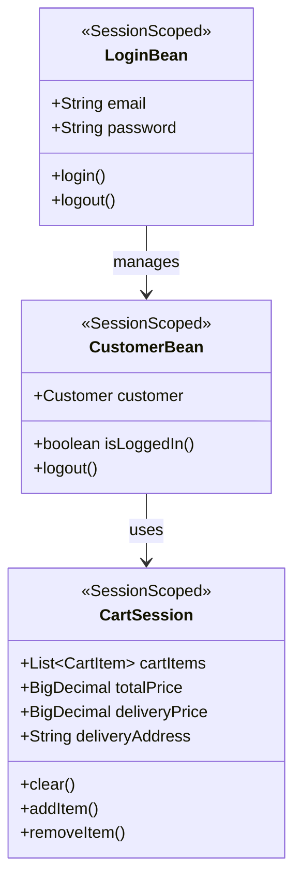

---

## 7. トランザクション管理

### 7.1 トランザクション境界

```mermaid
graph TD
    A[User Request] --> B{Transaction Required?}
    B -->|Yes| C[@Transactional Service Method]
    B -->|No| D[Non-Transactional Operation]
    
    C --> E[BEGIN TRANSACTION]
    E --> F[Business Logic]
    F --> G[DAO Operations]
    G --> H{Success?}
    H -->|Yes| I[COMMIT]
    H -->|No| J[ROLLBACK]
    I --> K[Return Result]
    J --> L[Throw Exception]
```

**トランザクション戦略:**
- **トランザクションタイプ**: JTA (Jakarta Transactions)
- **宣言**: サービスレイヤーで `@Transactional`
- **伝播**: REQUIRED (デフォルト) - 既存に参加または新規作成
- **ロールバック**: RuntimeException で自動ロールバック
- **スコープ**: サービスメソッドレベル

**トランザクション境界の例:**
- **OrderService.orderBooks()** - 以下を単一トランザクションで実行:
  1. 在庫可用性チェック
  2. 在庫更新（楽観的ロック付き）
  3. 注文トランザクション作成
  4. 注文明細作成

---

## 8. 並行制御

### 8.1 楽観的ロック戦略

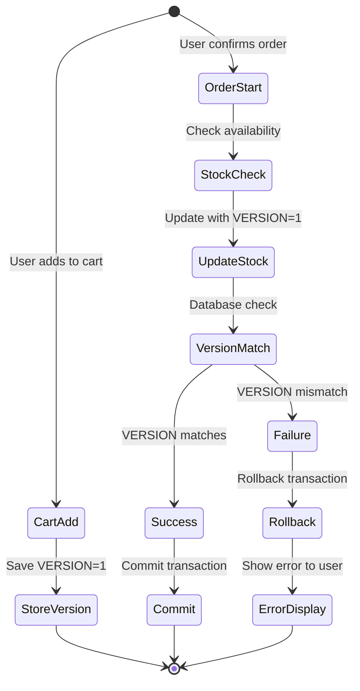

**実装詳細:**
- **バージョンカラム**: `STOCK.VERSION` (BIGINT NOT NULL)
- **JPAアノテーション**: Stock エンティティに `@Version`
- **更新クエリ**: 自動的に WHERE 句 `AND VERSION = ?` を追加
- **例外**: バージョン不一致時に `OptimisticLockException`
- **ユーザーアクション**: ユーザーに通知、カート再確認を許可

---

## 9. エラーハンドリング戦略

### 9.1 例外階層

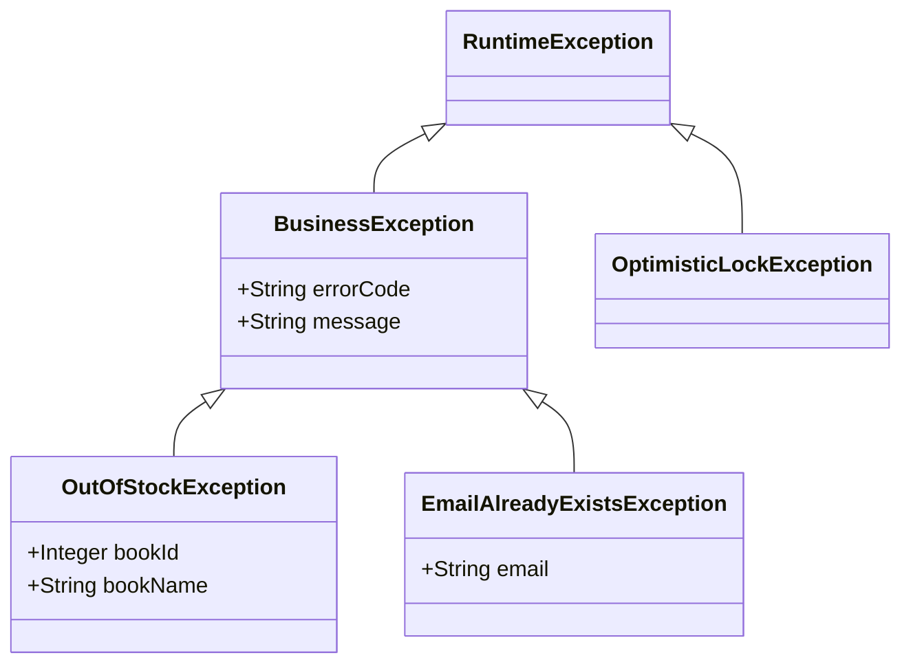

### 9.2 エラーハンドリングフロー

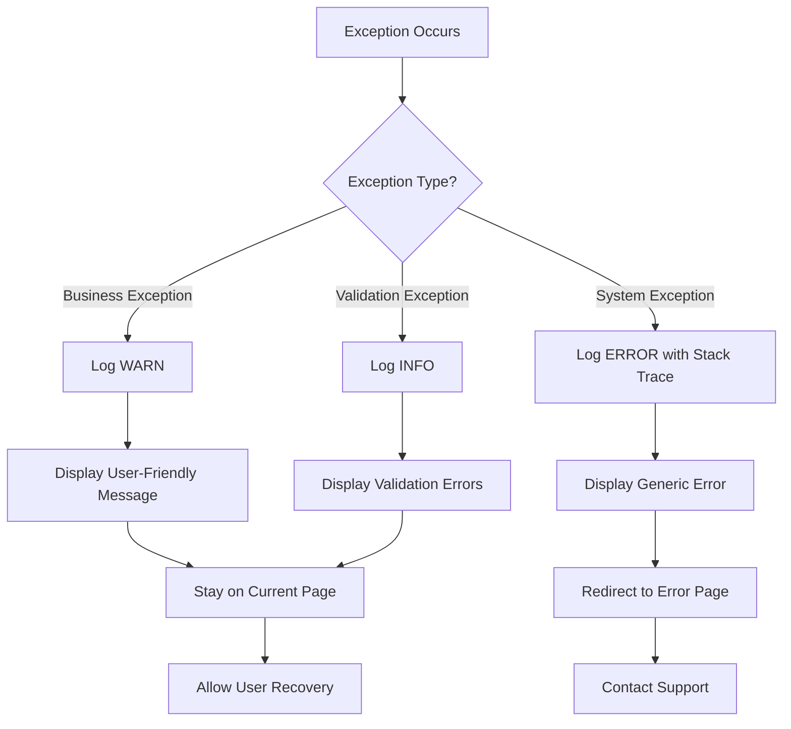

---

## 10. セキュリティアーキテクチャ

### 10.1 認証フロー

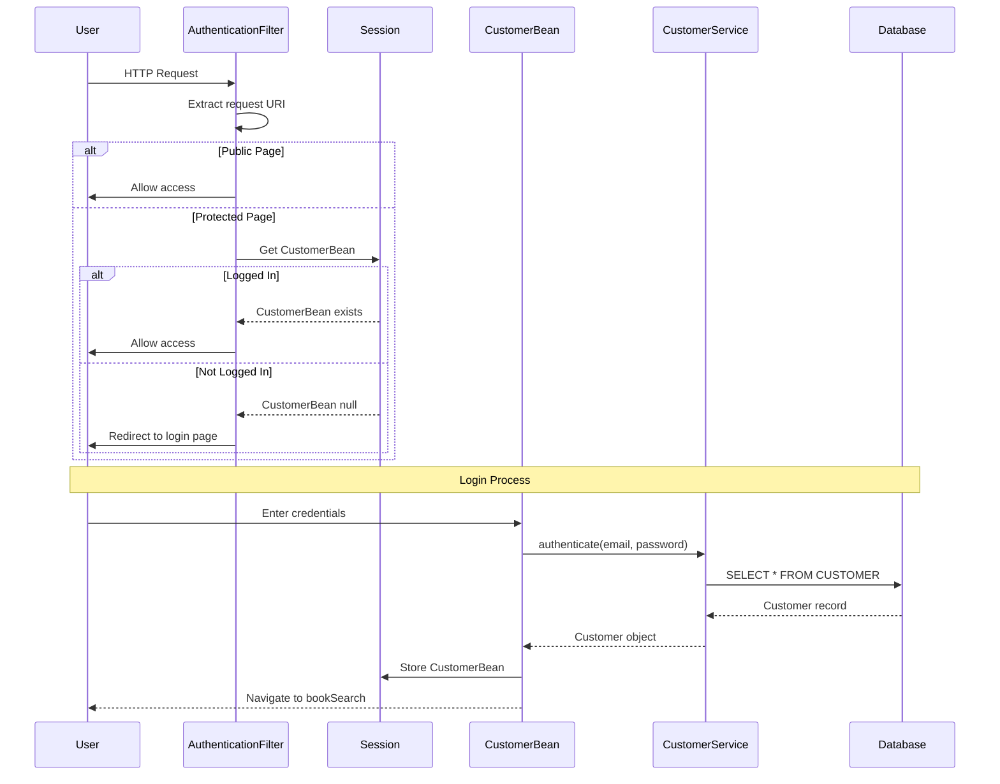

### 10.2 セキュリティ対策

| 対策 | 実装 | 制限事項 |
|---------|---------------|------------|
| **認証** | Servlet Filter + Session | シンプルなemail/passwordのみ |
| **セッション管理** | HTTP-Only Cookie | secureフラグ未使用（開発環境） |
| **入力検証** | Bean Validation (@NotNull, @Size等) | サーバーサイドのみ |
| **パスワード保存** | 平文 | ⚠️ 学習用のみ、本番環境では使用不可 |
| **CSRF保護** | JSF ViewState | 基本的な保護 |
| **SQLインジェクション** | JPA/JPQL (Prepared Statements) | パラメータ化クエリ |

**セキュリティ制約:**
- 🔒 以下を除く全ページで認証必須:
  - `index.xhtml` (ログインページ)
  - `customerInput.xhtml` (登録ページ)
  - `customerOutput.xhtml` (登録完了)

---

## 11. データベース構成

### 11.1 永続化構成

**persistence.xml:**
```xml
<persistence-unit name="BerryBooksPU" transaction-type="JTA">
    <jta-data-source>jdbc/HsqldbDS</jta-data-source>
    <properties>
        <property name="jakarta.persistence.schema-generation.database.action" 
                  value="none"/>
        <property name="eclipselink.logging.level" value="FINE"/>
        <property name="eclipselink.logging.parameters" value="true"/>
    </properties>
</persistence-unit>
```

### 11.2 コネクションプール

| パラメータ | 値 | 備考 |
|-----------|-------|-------|
| **JNDI名** | jdbc/HsqldbDS | DataSource JNDI ルックアップ |
| **プール名** | HsqldbPool | コネクションプール識別子 |
| **ドライバ** | org.hsqldb.jdbc.JDBCDriver | HSQLDB JDBC ドライバ |
| **URL** | jdbc:hsqldb:hsql://localhost:9001/testdb | TCP接続 |
| **ユーザー** | SA | デフォルトHSQLDBユーザー |
| **パスワード** | (空) | パスワードなし |
| **最小プールサイズ** | 10 | 最小接続数 |
| **最大プールサイズ** | 50 | 最大接続数 |

---

## 12. ログ戦略

### 12.1 ログフレームワーク

```
SLF4J (API) → Logback (Implementation)
```

### 12.2 ログレベル

| レベル | 用途 | 例 |
|-------|-------|---------|
| **ERROR** | システムエラー、例外 | データベース接続失敗 |
| **WARN** | ビジネス例外、警告 | OutOfStockException、検証失敗 |
| **INFO** | メソッド開始点、主要イベント | "[ OrderService#orderBooks ]" |
| **DEBUG** | 詳細フロー、パラメータ値 | "Stock version: 1, quantity: 10" |
| **TRACE** | 非常に詳細なデバッグ | このプロジェクトでは未使用 |

### 12.3 ログパターン

```
標準形式:
INFO  [ ClassName#methodName ] message

パラメータ付き:
INFO  [ ClassName#methodName ] param1=value1, param2=value2

例外:
ERROR [ ClassName#methodName ] Error message
java.lang.RuntimeException: ...
    at ...
```

---

## 13. ビルド＆デプロイ

### 13.1 ビルドプロセス

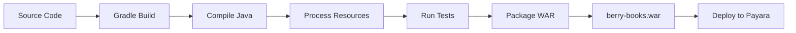

### 13.2 Gradleタスク

| タスク | コマンド | 説明 |
|------|---------|-------------|
| WARビルド | `./gradlew :projects:java:berry-books:war` | コンパイルとパッケージング |
| テスト実行 | `./gradlew :projects:java:berry-books:test` | ユニットテスト実行 |
| デプロイ | `./gradlew :projects:java:berry-books:deploy` | Payaraへデプロイ |
| アンデプロイ | `./gradlew :projects:java:berry-books:undeploy` | Payaraから削除 |
| DB初期化 | `./gradlew :projects:java:berry-books:setupHsqldb` | データベース初期化 |

---

## 14. テスト戦略

### 14.1 テストピラミッド

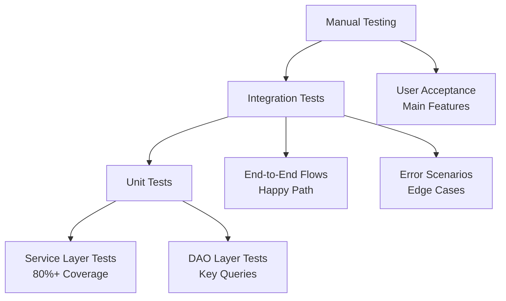

### 14.2 テストカバレッジ

| レイヤー | カバレッジ目標 | テストフレームワーク |
|-------|----------------|---------------|
| サービスレイヤー | 80%以上 | JUnit 5 + Mockito |
| DAOレイヤー | 主要メソッド | JUnit 5 + インメモリDB |
| 統合テスト | 主要フロー | 手動テスト |
| UI | 重要パス | 手動テスト |

---

## 15. デプロイアーキテクチャ

### 15.1 開発環境

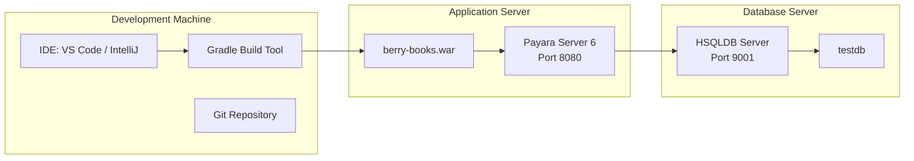

### 15.2 デプロイ構成

| コンポーネント | 配置場所 | ポート | 備考 |
|-----------|---------|------|-------|
| Payara Server | `./payara6/` | 8080 (HTTP), 4848 (Admin) | スタンドアロンインストール |
| HSQLDB Server | `./hsqldb/` | 9001 (TCP) | バックグラウンドプロセス |
| アプリケーションWAR | `build/libs/berry-books.war` | - | デプロイ成果物 |
| アプリケーションコンテキスト | `/berry-books` | - | コンテキストルート |

---

## 16. パフォーマンス考慮事項

### 16.1 最適化戦略

| 戦略 | 実装 | メリット |
|----------|---------------|---------|
| **遅延ロード** | JPAの `FetchType.LAZY` for collections | 初期クエリのオーバーヘッド削減 |
| **結合フェッチ** | JPQLの `JOIN FETCH` for eager loading | N+1問題の回避 |
| **コネクションプーリング** | Payaraコネクションプール (min=10, max=50) | データベース接続の再利用 |
| **セッション管理** | @SessionScoped (カート/ログイン) | データベースクエリの削減 |
| **楽観的ロック** | @Version (データベースロックなし) | 高並行性 |

### 16.2 期待パフォーマンス

| 指標 | 目標値 | 測定条件 |
|--------|--------|-------------|
| 検索クエリ | < 2秒 | カテゴリ/キーワードで50冊 |
| 注文処理 | < 3秒 | 在庫更新を含む |
| ページロード | < 3秒 | ファーストペイント |
| 同時ユーザー数 | 50ユーザー | 開発環境 |

---

## 17. 将来の拡張（スコープ外）

### 17.1 技術的改善

- [ ] REST API layer (JAX-RS)
- [ ] Password hashing (BCrypt)
- [ ] HTTPS support
- [ ] OAuth 2.0 authentication
- [ ] Caching layer (EhCache)
- [ ] Message queue (JMS)
- [ ] Microservices architecture

### 17.2 インフラ改善

- [ ] ロードバランサー
- [ ] データベースレプリケーション
- [ ] 静的アセット用CDN
- [ ] モニタリングと可観測性 (Prometheus, Grafana)
- [ ] CI/CDパイプライン

---

## 18. 技術リスクと軽減策

| リスク | 影響 | 発生確率 | 軽減策 |
|------|--------|-------------|------------|
| 楽観的ロック競合 | 注文失敗 | 中 | 明確なエラーメッセージ、再試行許可 |
| セッションタイムアウト | カートデータ喪失 | 低 | 60分タイムアウト、警告メッセージ |
| データベース接続枯渇 | サービス利用不可 | 低 | コネクションプール監視 |
| メモリリーク（セッションオブジェクト） | サーバー不安定化 | 低 | 適切なセッションクリーンアップ、監視 |
| HSQLDB制限 | パフォーマンス問題 | 中 | 開発用途のみ、PostgreSQL移行計画 |

---

## 19. 開発ガイドライン

### 19.1 コード標準

- **Javaバージョン**: 適切な箇所でJava 21機能を使用
- **コードスタイル**: Jakarta EE規約に従う
- **ログ出力**: 全パブリックサービスメソッドのエントリをログ
- **コメント**: パブリックAPI用にJavaDoc
- **エラーハンドリング**: 例外を握りつぶさない
- **NULL安全性**: 適切な箇所でOptionalを使用

### 19.2 Gitワークフロー

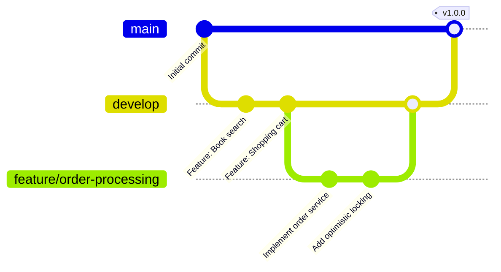

---

## 20. 参考資料

### 20.1 技術ドキュメント

- [Jakarta EE 10 Platform Specification](https://jakarta.ee/specifications/platform/10/)
- [Jakarta Faces 4.0 Specification](https://jakarta.ee/specifications/faces/4.0/)
- [Jakarta Persistence 3.1 Specification](https://jakarta.ee/specifications/persistence/3.1/)
- [Payara Server Documentation](https://docs.payara.fish/)
- [EclipseLink JPA Documentation](https://www.eclipse.org/eclipselink/documentation/)

### 20.2 ベストプラクティス

- [Jakarta EE Design Patterns](https://www.oracle.com/java/technologies/design-patterns.html)
- [Optimistic Locking in JPA](https://thorben-janssen.com/optimistic-locking-in-jpa-hibernate/)
- [CDI Scopes Best Practices](https://jakarta.ee/specifications/cdi/4.0/jakarta-cdi-spec-4.0.html)

---

**ドキュメント終了**

*この技術計画書は、アーキテクチャ、技術選択、デザインパターンを含む、システムの実装方法を記述しています。spec.md（何を・なぜ）を補完し、tasks.md（実装の詳細分解）の生成に使用されます。*
