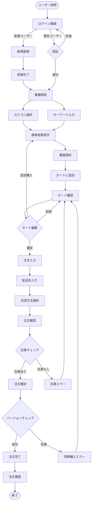
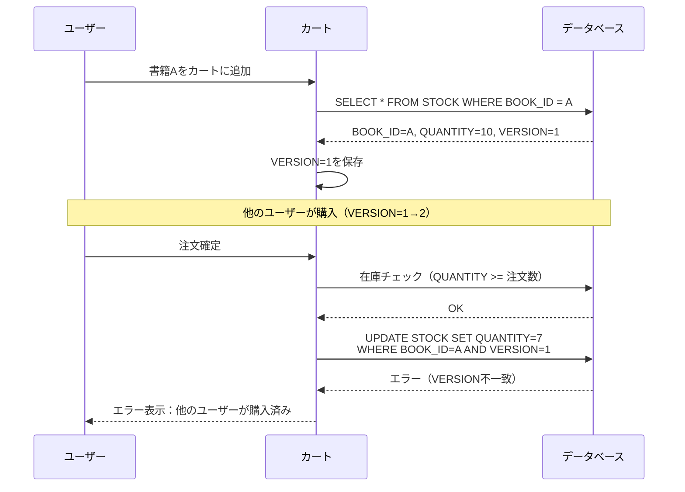

# berry-books - 機能仕様書

**Feature ID:** 001-berry-books  
**Version:** 1.0.0  
**Last Updated:** 2025-12-13  
**Status:** Reverse Engineered from Existing Implementation

---

## 1. 概要

### 1.1 構築するもの

berry-booksは、書籍を検索・購入できるオンライン書店Webアプリケーションです。顧客は書籍を閲覧し、ショッピングカートに追加し、注文を確定できます。

### 1.2 構築する理由

**ビジネス目標:**
- 書籍のオンライン販売チャネルを提供
- 顧客の購買体験を向上
- 在庫管理の効率化
- 注文履歴の可視化

**成功指標:**
- 書籍検索から購入までのコンバージョン率
- ショッピングカート放棄率
- 在庫不整合の発生率（目標: 0%）
- ユーザーの注文完了率

---

## 2. ユーザーペルソナ

### ペルソナ 1: 一般顧客（エンドユーザー）

**プロフィール:**
- 年齢: 20-50代
- 目的: 技術書・専門書の購入
- デバイス: PC、タブレット
- 技術レベル: 基本的なWeb操作ができる

**ニーズ:**
- 効率的に目的の書籍を見つけたい
- 購入前に在庫状況を確認したい
- 安全に注文処理を完了したい
- 過去の注文履歴を参照したい

**課題:**
- 書籍が多すぎて目的の本を見つけにくい
- 注文確定後に在庫切れが判明する
- 配送料金が明確でない

---

## 3. コア機能

### 機能 3.1: 書籍検索・閲覧

#### ユーザーストーリー
```
As a 一般顧客
I want to カテゴリやキーワードで書籍を検索する
So that 目的の書籍を効率的に見つけることができる
```

#### 受入基準

**Given-When-Then形式:**

```gherkin
Scenario: カテゴリで書籍を絞り込む
  Given ユーザーが書籍検索画面にアクセスしている
  When ユーザーがカテゴリ「Java」を選択して検索する
  Then Java カテゴリの書籍一覧が表示される
  And 各書籍には書籍名、著者、出版社、価格、在庫数が表示される

Scenario: キーワードで書籍を検索する
  Given ユーザーが書籍検索画面にアクセスしている
  When ユーザーがキーワード「Spring」を入力して検索する
  Then 書籍名または著者に「Spring」を含む書籍一覧が表示される

Scenario: カテゴリとキーワードを組み合わせて検索する
  Given ユーザーが書籍検索画面にアクセスしている
  When ユーザーがカテゴリ「Java」とキーワード「Spring」を入力して検索する
  Then Java カテゴリかつ「Spring」を含む書籍のみが表示される

Scenario: 在庫なしの書籍も表示される
  Given ユーザーが検索結果を閲覧している
  When 在庫数が0の書籍が存在する
  Then その書籍も検索結果に表示される
  And 在庫数「0」が表示される
  But カートへの追加はできない（グレーアウト）
```

#### ビジネスルール

| ルールID | 説明 |
|---------|-------------|
| BR-001 | カテゴリ未選択の場合、全カテゴリが検索対象 |
| BR-002 | キーワード未入力の場合、書籍名と著者の両方を検索 |
| BR-003 | 検索結果は書籍ID昇順でソート |
| BR-004 | 在庫0の書籍も表示（購入不可） |

---

### 機能 3.2: ショッピングカート管理

#### ユーザーストーリー
```
As a 一般顧客
I want to 選択した書籍をカートに追加・管理する
So that 購入前に内容を確認・調整できる
```

#### Acceptance Criteria

```gherkin
Scenario: 書籍をカートに追加する
  Given ユーザーが検索結果画面で書籍を閲覧している
  When ユーザーが書籍を選択し、数量「2」を入力してカートに追加する
  Then カート確認画面に遷移する
  And カートに選択した書籍が数量「2」で表示される
  And 合計金額が自動計算される

Scenario: カート内の書籍を削除する
  Given ユーザーがカート内に複数の書籍がある
  When ユーザーが特定の書籍にチェックを入れて削除ボタンをクリックする
  Then その書籍がカートから削除される
  And 合計金額が再計算される

Scenario: カート全体をクリアする
  Given ユーザーがカート内に書籍がある
  When ユーザーが「カートをクリア」ボタンをクリックする
  Then 全ての書籍がカートから削除される
  And 合計金額が0円になる

Scenario: 同じ書籍を複数回追加する
  Given ユーザーがカートに書籍A（数量2）を追加済み
  When ユーザーが再度書籍A（数量3）を追加する
  Then カート内の書籍Aの数量が「5」に更新される
  And 価格も数量に応じて更新される
```

#### ビジネスルール

| ルールID | 説明 |
|---------|-------------|
| BR-010 | カート内容はセッション単位で保持（ログアウトまで） |
| BR-011 | 同じ書籍を追加した場合、数量を加算 |
| BR-012 | カート追加時点の在庫バージョン番号を保存（楽観的ロック用） |
| BR-013 | カート内の合計金額は常に自動計算 |

---

### 機能 3.3: 注文処理

#### ユーザーストーリー
```
As a 一般顧客
I want to カート内の書籍を購入し、配送先と決済方法を指定する
So that 書籍を受け取ることができる
```

#### Acceptance Criteria

```gherkin
Scenario: 注文を確定する（正常系）
  Given ユーザーがカート内に書籍がある状態で注文画面に遷移している
  And 全ての書籍の在庫が十分にある
  When ユーザーが配送先住所「東京都渋谷区...」を入力する
  And 決済方法「クレジットカード」を選択する
  And 「注文確定」ボタンをクリックする
  Then 注文が確定される
  And 注文IDが発行される
  And 各書籍の在庫数が注文数分減少する
  And カートがクリアされる
  And 注文完了画面に遷移する

Scenario: 在庫不足エラー（異常系）
  Given ユーザーがカートに書籍A（数量5）を追加している
  And 書籍Aの現在の在庫数が「3」である
  When ユーザーが注文確定ボタンをクリックする
  Then エラーメッセージ「在庫不足です」が表示される
  And 注文は確定されない
  And カートはクリアされない

Scenario: 同時注文による競合（楽観的ロック）
  Given ユーザーAとユーザーBが同じ書籍をカートに追加している（在庫5）
  And ユーザーAが数量3、ユーザーBが数量3を注文しようとしている
  When ユーザーAが先に注文を確定する（在庫5→2）
  And ユーザーBが後から注文を確定しようとする
  Then ユーザーBにエラーメッセージ「他のユーザーが同時に購入しました」が表示される
  And ユーザーBの注文は確定されない
  And ユーザーBはカートを再確認できる

Scenario: 配送料金の自動計算
  Given ユーザーが購入金額3000円のカートを確認している
  When ユーザーが配送先住所「東京都」を入力する
  Then 配送料金「800円」が表示される
  And 総合計「3800円」が表示される

Scenario: 沖縄県への配送料金
  Given ユーザーが購入金額3000円のカートを確認している
  When ユーザーが配送先住所「沖縄県那覇市」を入力する
  Then 配送料金「1700円」が表示される
  And 総合計「4700円」が表示される

Scenario: 送料無料（5000円以上）
  Given ユーザーが購入金額5500円のカートを確認している
  When ユーザーが配送先住所「東京都」を入力する
  Then 配送料金「0円（送料無料）」が表示される
  And 総合計「5500円」が表示される
```

#### ビジネスルール

| ルールID | 説明 | 詳細 |
|---------|-------------|---------|
| BR-020 | 配送料金計算ルール | 通常800円、沖縄県1700円、購入金額5000円以上で送料無料 |
| BR-021 | 決済方法選択肢 | 銀行振込、クレジットカード、着払い |
| BR-022 | 在庫チェックタイミング | 注文確定時に全書籍の在庫を確認 |
| BR-023 | 在庫減算タイミング | 在庫チェック後、注文登録前に減算 |
| BR-024 | 楽観的ロック制御 | カート追加時のバージョン番号で在庫更新 |
| BR-025 | トランザクション範囲 | 在庫チェック〜注文登録〜在庫減算は単一トランザクション |

#### ビジネスルール詳細: 配送料金計算

```
IF 購入金額 >= 5000円 THEN
    配送料金 = 0円（送料無料）
ELSE IF 配送先住所 が "沖縄県" で始まる THEN
    配送料金 = 1700円
ELSE
    配送料金 = 800円（通常配送）
END IF
```

#### ビジネスルール詳細: 楽観的ロック制御

```
フェーズ 1: カート追加時
  - 在庫エンティティからVERSION値を取得
  - VERSION値をカートアイテムに保存

フェーズ 2: 注文確定時
  - カートアイテムに保存したVERSION値で在庫を更新
  - データベースのWHERE句に「AND VERSION = ?」条件を追加
  - VERSION値が一致しない場合、OptimisticLockException発生
  - 例外発生時、ユーザーにエラーメッセージを表示

フェーズ 3: 正常時
  - 在庫数を減算
  - VERSION値を自動インクリメント（JPA @Version機能）
```

---

### 機能 3.4: 顧客管理・認証

#### ユーザーストーリー
```
As a 新規顧客
I want to アカウントを登録してログインする
So that 書籍を購入し、注文履歴を管理できる
```

#### Acceptance Criteria

```gherkin
Scenario: 新規顧客登録（正常系）
  Given ユーザーが新規登録画面にアクセスしている
  When ユーザーが以下の情報を入力する
    | 項目 | 値 |
    | 顧客名 | 山田太郎 |
    | メールアドレス | yamada@example.com |
    | パスワード | password123 |
    | 生年月日 | 1990-01-01 |
    | 住所 | 東京都渋谷区... |
  And 「登録」ボタンをクリックする
  Then アカウントが作成される
  And 登録完了画面に遷移する

Scenario: メールアドレス重複エラー（異常系）
  Given データベースに「yamada@example.com」のアカウントが既に存在する
  When ユーザーが同じメールアドレス「yamada@example.com」で登録しようとする
  Then エラーメッセージ「メールアドレスが既に使用されています」が表示される
  And アカウントは作成されない

Scenario: ログイン（正常系）
  Given ユーザーが登録済みアカウントを持っている
  When ユーザーがメールアドレス「yamada@example.com」とパスワード「password123」を入力してログインする
  Then ログインが成功する
  And 書籍検索画面に遷移する
  And セッションにログイン状態が保存される

Scenario: ログイン失敗（異常系）
  Given ユーザーがログイン画面にアクセスしている
  When ユーザーが誤ったパスワードを入力してログインしようとする
  Then エラーメッセージ「メールアドレスまたはパスワードが正しくありません」が表示される
  And ログインは成功しない

Scenario: 未ログインユーザーのアクセス制限
  Given ユーザーがログインしていない
  When ユーザーが書籍検索画面にアクセスしようとする
  Then ログイン画面にリダイレクトされる

Scenario: ログアウト
  Given ユーザーがログイン済みの状態
  When ユーザーが「ログアウト」ボタンをクリックする
  Then セッションが無効化される
  And ログイン画面に遷移する
```

#### ビジネスルール

| ルールID | 説明 |
|---------|-------------|
| BR-030 | メールアドレスは一意（重複不可） |
| BR-031 | パスワードは平文保存（学習用のみ、本番環境では非推奨） |
| BR-032 | セッションタイムアウト: 60分 |
| BR-033 | 公開ページ: ログイン画面、新規登録画面、登録完了画面 |
| BR-034 | 公開ページ以外は認証必須 |

---

### 機能 3.5: 注文履歴参照

#### ユーザーストーリー
```
As a 登録顧客
I want to 過去の注文履歴を確認する
So that 購入済み書籍と配送状況を把握できる
```

#### Acceptance Criteria

```gherkin
Scenario: 注文履歴一覧を表示する
  Given ユーザーがログイン済みで過去に3件の注文がある
  When ユーザーが「注文履歴」メニューをクリックする
  Then 注文履歴一覧が表示される
  And 各注文には以下の情報が表示される
    | 項目 | 例 |
    | 注文ID | 1001 |
    | 注文日 | 2025-12-01 |
    | 配送先 | 東京都渋谷区... |
    | 決済方法 | クレジットカード |
    | 合計金額 | 3800円 |

Scenario: 注文詳細を表示する
  Given ユーザーが注文履歴一覧を閲覧している
  When ユーザーが特定の注文をクリックする
  Then 注文詳細画面に遷移する
  And 注文明細（購入書籍、数量、単価）が表示される
  And 配送料金と総合計が表示される

Scenario: 注文履歴が空の場合
  Given ユーザーがログイン済みだが注文履歴がない
  When ユーザーが「注文履歴」メニューをクリックする
  Then 「注文履歴はありません」というメッセージが表示される
```

#### ビジネスルール

| ルールID | 説明 |
|---------|-------------|
| BR-040 | 注文履歴は顧客IDでフィルタリング |
| BR-041 | 注文日降順（新しい順）でソート |
| BR-042 | 注文詳細は注文IDで取得 |

---

## 4. ユーザーフロー

### 4.1 メインユーザーフロー: 書籍購入フロー



### 4.2 楽観的ロックフロー



---

## 5. エッジケース＆エラーシナリオ

### 5.1 在庫管理

| シナリオ | 期待される動作 |
|----------|-------------------|
| 在庫0の書籍を検索 | 検索結果に表示、カート追加不可 |
| カート追加後に在庫0になった | 注文時に在庫不足エラー |
| 複数ユーザーが同時購入 | 先着順、後続ユーザーはエラー |
| 在庫数より多い数量を注文 | 注文確定時にエラー |

### 5.2 認証・セッション

| シナリオ | 期待される動作 |
|----------|-------------------|
| セッションタイムアウト | ログイン画面にリダイレクト |
| 直接URL入力（未ログイン） | ログイン画面にリダイレクト |
| ログアウト後のブラウザバック | ログイン画面にリダイレクト |
| 重複ログイン | 最新のセッションのみ有効 |

### 5.3 カート操作

| シナリオ | 期待される動作 |
|----------|-------------------|
| 空カートで注文画面へ遷移 | エラーメッセージ表示 |
| カート内の書籍が削除された | 注文時にエラー |
| カート内の価格が変更された | カート追加時の価格で注文 |

---

## 6. 非機能要件

### 6.1 パフォーマンス

| 指標 | 目標値 |
|--------|--------|
| 書籍検索レスポンス | < 2秒 |
| ページ読み込み時間 | < 3秒 |
| 注文処理完了時間 | < 3秒 |
| 同時接続ユーザー数 | 50ユーザー |

### 6.2 ユーザビリティ

| 要件 | 説明 |
|-------------|-------------|
| レスポンシブデザイン | PC、タブレット対応 |
| エラーメッセージ | 明確で理解しやすい日本語メッセージ |
| 操作性 | 3クリック以内で主要機能にアクセス可能 |
| フィードバック | 処理中はローディング表示 |

### 6.3 セキュリティ

| 要件 | 説明 |
|-------------|-------------|
| 認証 | 全画面で認証必須（公開ページを除く） |
| セッション管理 | HTTP-Only Cookie使用 |
| 入力検証 | サーバーサイドで全入力を検証 |
| パスワード保存 | 平文（学習用のみ、本番非推奨） |

### 6.4 信頼性

| 要件 | 説明 |
|-------------|-------------|
| データ整合性 | 楽観的ロックで在庫不整合を防止 |
| トランザクション | 注文処理は単一トランザクション |
| エラーハンドリング | 全エラーをユーザーに通知 |
| ログ出力 | 全主要処理でログを記録 |

---

## 7. スコープ外

以下の機能は本プロジェクトの対象外です：

- [ ] 決済システム連携（決済方法選択のみ）
- [ ] 配送業者API連携
- [ ] メール通知機能
- [ ] レビュー・評価機能
- [ ] お気に入り機能
- [ ] クーポン・割引機能
- [ ] ポイントシステム
- [ ] モバイルアプリ
- [ ] 多言語対応
- [ ] 管理者画面

---

## 8. 依存関係と前提条件

### 8.1 依存関係

- 顧客データベースが利用可能であること
- 書籍マスタデータが事前に登録されていること
- ネットワーク接続が安定していること

### 8.2 前提条件

- 本システムは学習目的で構築される
- 本番運用は想定しない
- 同時アクセスユーザー数は最大50ユーザー
- データベースはシングルサーバー構成
- パスワードは平文保存（学習用のみ）

---

## 9. 成功基準

本仕様の実装が完了したと判断される条件：

- [ ] 全てのユーザーストーリーが実装され、受入基準を満たす
- [ ] 全てのビジネスルールが実装されている
- [ ] 楽観的ロックが正常に動作し、在庫不整合が発生しない
- [ ] 全てのエラーシナリオが適切に処理される
- [ ] 非機能要件を満たす
- [ ] 主要機能の手動テストが完了している

---

## 10. 改訂履歴

| バージョン | 日付 | 作成者 | 変更内容 |
|---------|------|--------|---------|
| 1.0.0 | 2025-12-13 | System | 既存実装からのリバースエンジニアリング |

---

**ドキュメント終了**

*この仕様書は、システムが「何を」「なぜ」行うかを記述しており、「どのように」実装すべきかは規定していません。技術的な実装詳細は plan.md に別途記載されています。*

