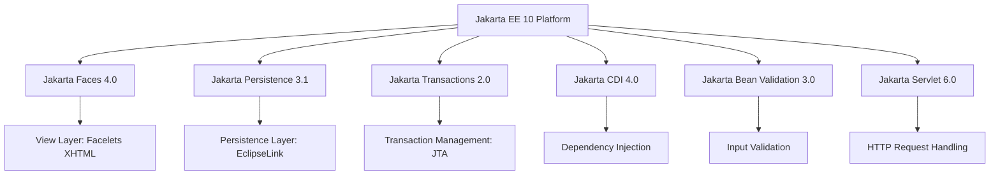
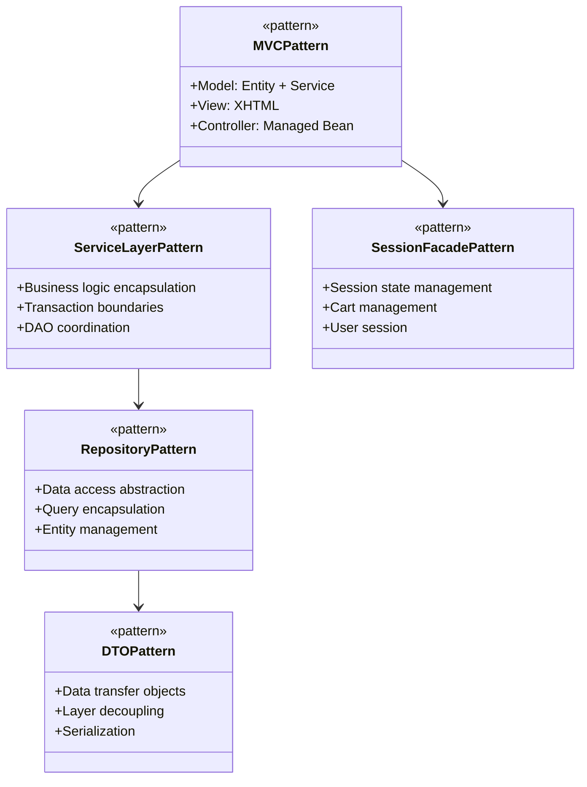
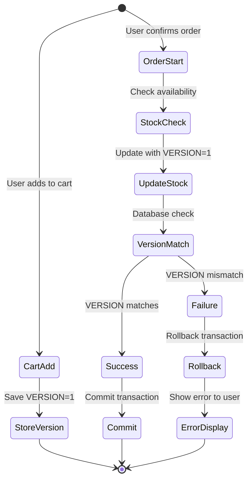
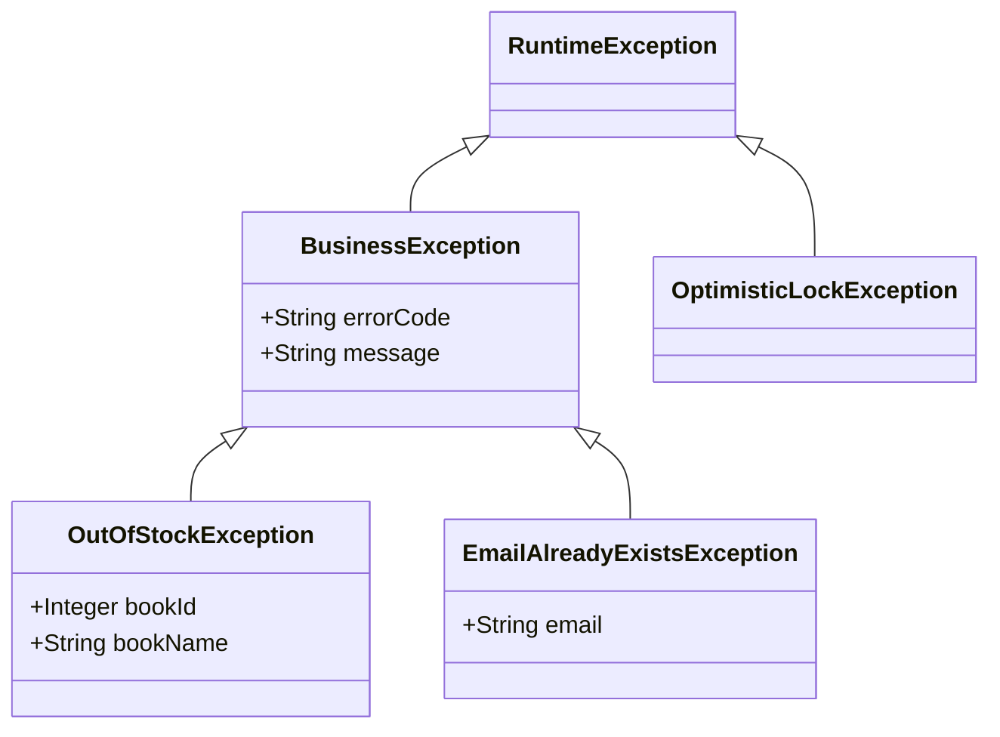
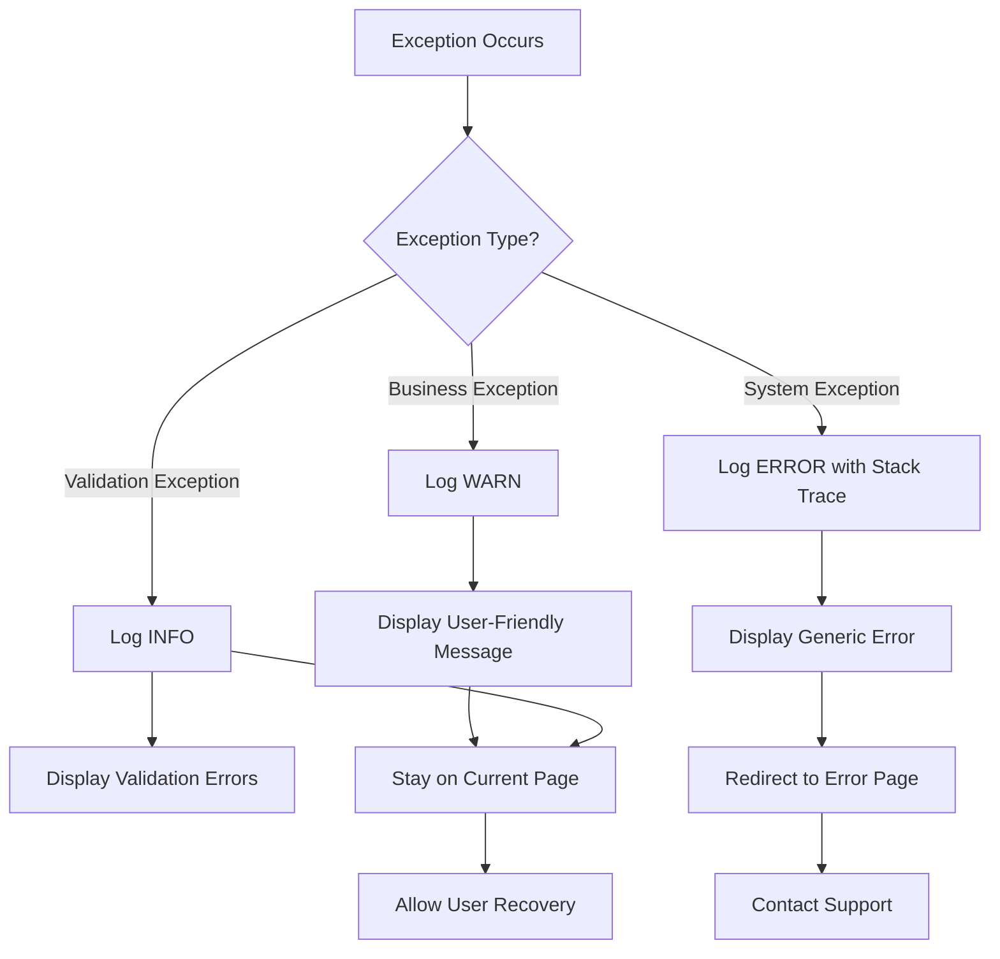
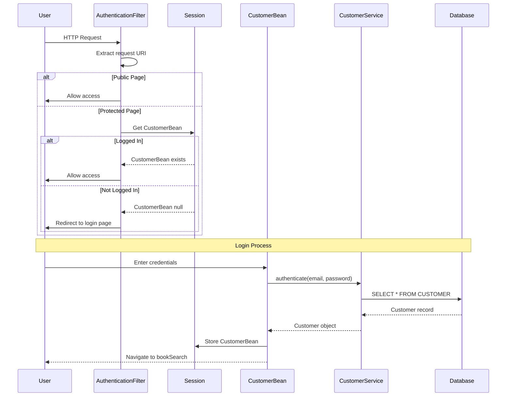
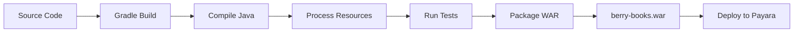
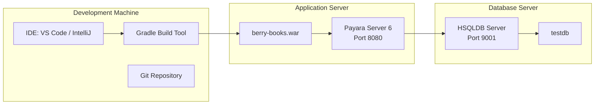
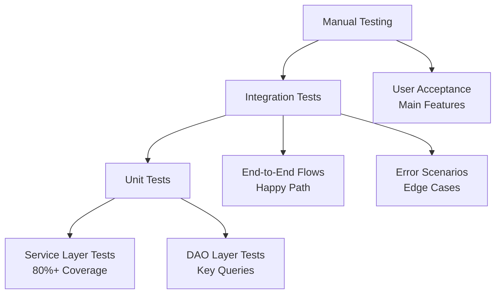
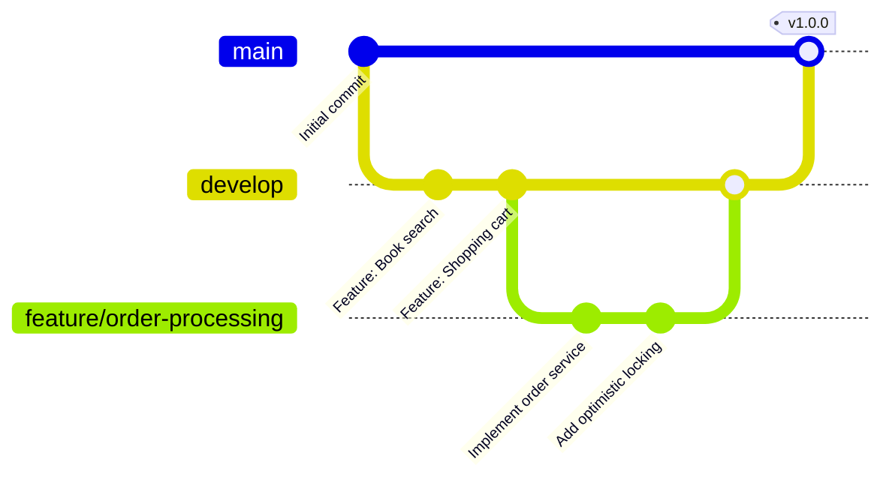

# berry-books - アーキテクチャ設計書

**プロジェクトID:** 001-berry-books  
**バージョン:** 1.2.0  
**最終更新日:** 2025-12-14  
**ステータス:** アーキテクチャ設計完了

---

## 1. 技術スタック

### 1.1 コアプラットフォーム

| レイヤー | 技術 | バージョン | 選定理由 |
|-------|-----------|---------|-----------|
| **ランタイム** | JDK | 21 | LTSバージョン、最新のJava機能を使用可能 |
| **プラットフォーム** | Jakarta EE | 10.0 | Javaエンタープライズアプリケーションの標準 |
| **アプリサーバー** | Payara Server | 6.x | Jakarta EE 10完全準拠、本番環境対応 |
| **データベース** | HSQLDB | 2.7.x | 学習・開発用の組み込みデータベース |
| **ビルドツール** | Gradle | 8.x | マルチプロジェクト対応の最新ビルドツール |

### 1.2 Jakarta EE仕様



| 仕様 | バージョン | 目的 |
|--------------|---------|---------|
| Jakarta Faces (JSF) | 4.0 | MVC Webフレームワーク |
| Jakarta Persistence (JPA) | 3.1 | オブジェクト関係マッピング |
| Jakarta Transactions (JTA) | 2.0 | 分散トランザクション管理 |
| Jakarta CDI | 4.0 | 依存性注入とコンテキスト管理 |
| Jakarta Bean Validation | 3.0 | 入力検証フレームワーク |
| Jakarta Servlet | 6.0 | HTTPリクエスト/レスポンス処理 |

### 1.3 追加ライブラリ

| ライブラリ | 目的 | 選定理由 |
|---------|---------|-----------|
| SLF4J + Logback | ログ出力 | 業界標準のロギングファサード |
| JUnit 5 | ユニットテスト | 最新のテストフレームワーク |
| Mockito | モッキング | ユニットテストの独立性確保 |

---

## 2. アーキテクチャ設計

### 2.1 レイヤードアーキテクチャ

```mermaid
graph TB
    subgraph "Presentation Layer"
        View[JSF Facelets<br/>XHTML + CSS]
        Controller[Managed Beans<br/>@Named @ViewScoped<br/>@SessionScoped]
    end
    
    subgraph "Business Logic Layer"
        Service[Service Classes<br/>@ApplicationScoped<br/>@Transactional]
    end
    
    subgraph "Data Access Layer"
        DAO[DAO Classes<br/>@ApplicationScoped<br/>EntityManager]
    end
    
    subgraph "Persistence Layer"
        Entity[JPA Entities<br/>@Entity<br/>Relationships]
    end
    
    subgraph "Database Layer"
        DB[(HSQLDB<br/>testdb)]
    end
    
    View -->|User Input| Controller
    Controller -->|@Inject| Service
    Service -->|@Inject| DAO
    DAO -->|@PersistenceContext| Entity
    Entity -->|JDBC| DB
    
    Controller -->|Display Data| View
```

### 2.2 コンポーネントの責務

| レイヤー | 責務 | 禁止事項 |
|-------|-----------------|-------------------|
| **View (XHTML)** | • UIレンダリング<br/>• ユーザー入力の収集<br/>• 表示フォーマット | • ビジネスロジック<br/>• 直接データベースアクセス<br/>• 複雑な計算 |
| **Controller (Managed Bean)** | • リクエスト処理<br/>• ナビゲーション制御<br/>• 入力検証の表示<br/>• サービス委譲 | • 直接データベースアクセス<br/>• ビジネスルール実装<br/>• トランザクション管理 |
| **Service** | • ビジネスロジック<br/>• トランザクション境界<br/>• 複数DAOの連携<br/>• ビジネス検証 | • UI固有ロジック<br/>• 直接SQLクエリ<br/>• HTTPリクエスト処理 |
| **DAO** | • CRUD操作<br/>• クエリ実行<br/>• エンティティライフサイクル管理 | • ビジネスロジック<br/>• トランザクション制御<br/>• UI関連処理 |
| **Entity** | • データ構造<br/>• リレーションシップ<br/>• データベースマッピング | • ビジネスロジック<br/>• 検証ロジック（Bean Validationを使用） |

---

## 3. デザインパターン

### 3.1 適用パターン



| パターン | 実装 | メリット |
|---------|---------------|---------|
| **MVC** | JSF + Managed Bean + Service | 関心事の分離 |
| **サービスレイヤー** | @ApplicationScoped Service クラス | ビジネスロジックの集約 |
| **リポジトリ (DAO)** | EntityManager を使用した DAO クラス | データアクセスの抽象化 |
| **DTO/転送オブジェクト** | OrderTO, OrderHistoryTO | レイヤー間の疎結合 |
| **セッションファサード** | @SessionScoped beans | セッション状態管理 |
| **依存性注入** | @Inject (CDI) | 疎結合化 |
| **楽観的ロック** | @Version (JPA) | 並行制御 |
| **トランザクションスクリプト** | @Transactional メソッド | トランザクション管理 |

---

## 4. パッケージ構造と命名規則

### 4.1 パッケージ編成

```
pro.kensait.berrybooks/
├── common/                      # 共通ユーティリティと定数
│   ├── MessageUtil              # メッセージリソースユーティリティ
│   └── SettlementType          # 決済方法列挙型
│
├── util/                        # 汎用ユーティリティ
│   └── AddressUtil             # 住所処理ユーティリティ
│
├── web/                         # プレゼンテーション層（JSF Managed Beans）
│   ├── book/
│   │   ├── BookSearchBean      # 書籍検索コントローラー
│   │   └── SearchParam         # 検索パラメータホルダー
│   ├── cart/
│   │   ├── CartBean            # ショッピングカートコントローラー
│   │   ├── CartItem            # カートアイテムDTO
│   │   └── CartSession         # カートセッションファサード
│   ├── order/
│   │   └── OrderBean           # 注文処理コントローラー
│   ├── customer/
│   │   └── CustomerBean        # 顧客管理コントローラー
│   ├── login/
│   │   └── LoginBean           # ログインコントローラー
│   └── filter/
│       └── AuthenticationFilter # 認証フィルター
│
├── service/                     # ビジネスロジック層
│   ├── book/
│   │   └── BookService         # 書籍ビジネスロジック
│   ├── category/
│   │   └── CategoryService     # カテゴリ管理
│   ├── customer/
│   │   ├── CustomerService     # 顧客管理
│   │   └── EmailAlreadyExistsException
│   ├── delivery/
│   │   └── DeliveryFeeService  # 配送料金計算
│   └── order/
│       ├── OrderService        # 注文処理
│       ├── OrderServiceIF      # 注文サービスインターフェース
│       ├── OrderTO             # 注文転送オブジェクト
│       ├── OrderHistoryTO      # 注文履歴DTO
│       ├── OrderSummaryTO      # 注文サマリーDTO
│       └── OutOfStockException # 在庫切れ例外
│
├── dao/                         # データアクセス層
│   ├── BookDao                 # 書籍データアクセス
│   ├── CategoryDao             # カテゴリデータアクセス
│   ├── CustomerDao             # 顧客データアクセス
│   ├── StockDao                # 在庫データアクセス
│   ├── OrderTranDao            # 注文トランザクションデータアクセス
│   └── OrderDetailDao          # 注文明細データアクセス
│
└── entity/                      # 永続化層（JPAエンティティ）
    ├── Book                    # 書籍エンティティ
    ├── Category                # カテゴリエンティティ
    ├── Publisher               # 出版社エンティティ
    ├── Stock                   # 在庫エンティティ（@Version付き）
    ├── Customer                # 顧客エンティティ
    ├── OrderTran               # 注文トランザクションエンティティ
    ├── OrderDetail             # 注文明細エンティティ
    └── OrderDetailPK           # 注文明細複合キー
```

### 4.2 命名規則

| コンポーネントタイプ | パターン | 例 |
|---------------|---------|---------|
| Entity | PascalCase 名詞 | `Book`, `OrderTran` |
| DAO | EntityName + Dao | `BookDao`, `StockDao` |
| Service | EntityName + Service | `BookService`, `OrderService` |
| Managed Bean | FeatureName + Bean | `BookSearchBean`, `CartBean` |
| DTO/TO | Purpose + TO | `OrderTO`, `OrderHistoryTO` |
| Exception | ErrorType + Exception | `OutOfStockException` |
| Enum | PascalCase | `SettlementType` |
| Utility | FeatureName + Util | `MessageUtil`, `AddressUtil` |

---

## 5. 状態管理（CDIスコープ）

### 5.1 CDIスコープ

```mermaid
graph LR
    A[@RequestScoped] -->|Single Request| B[Input validation<br/>Simple queries]
    C[@ViewScoped] -->|Single Page<br/>Multiple Ajax| D[Search results<br/>Order input]
    E[@SessionScoped] -->|User Session| F[Login state<br/>Shopping cart]
    G[@ApplicationScoped] -->|Application Lifetime| H[Services<br/>DAOs<br/>Stateless beans]
```

| スコープ | ライフサイクル | 使用ケース | Serializable実装必須 |
|-------|-----------|-----------|----------------------------|
| @RequestScoped | 単一HTTPリクエスト | 入力フォーム、単純なクエリ | いいえ |
| @ViewScoped | 単一ページビュー（Ajax対応） | 検索結果、複数ステップフォーム | **はい** |
| @SessionScoped | ユーザーセッション | ログイン状態、ショッピングカート | **はい** |
| @ApplicationScoped | アプリケーション起動〜終了 | Services、DAOs、ユーティリティ | いいえ |

---

## 6. トランザクション管理

### 6.1 トランザクション境界

```mermaid
graph TD
    A[User Request] --> B{Transaction Required?}
    B -->|Yes| C[@Transactional Service Method]
    B -->|No| D[Non-Transactional Operation]
    
    C --> E[BEGIN TRANSACTION]
    E --> F[Business Logic]
    F --> G[DAO Operations]
    G --> H{Success?}
    H -->|Yes| I[COMMIT]
    H -->|No| J[ROLLBACK]
    I --> K[Return Result]
    J --> L[Throw Exception]
```

### 6.2 トランザクション戦略

**基本方針:**
- **トランザクションタイプ**: JTA (Jakarta Transactions)
- **宣言**: サービスレイヤーで `@Transactional`
- **伝播**: REQUIRED (デフォルト) - 既存に参加または新規作成
- **ロールバック**: RuntimeException で自動ロールバック
- **スコープ**: サービスメソッドレベル

**トランザクション境界の例:**
- **OrderService.orderBooks()** - 以下を単一トランザクションで実行:
  1. 在庫可用性チェック
  2. 在庫更新（楽観的ロック付き）
  3. 注文トランザクション作成
  4. 注文明細作成

---

## 7. 並行制御（楽観的ロック）

### 7.1 楽観的ロック戦略



### 7.2 実装詳細

**技術仕様:**
- **バージョンカラム**: `STOCK.VERSION` (BIGINT NOT NULL)
- **JPAアノテーション**: Stock エンティティに `@Version`
- **更新クエリ**: 自動的に WHERE 句 `AND VERSION = ?` を追加
- **例外**: バージョン不一致時に `OptimisticLockException`
- **ユーザーアクション**: ユーザーに通知、カート再確認を許可

**処理フロー:**

1. **カート追加時**: 在庫エンティティからVERSION値を取得し、カートアイテムに保存
2. **注文確定時**: カートアイテムに保存したVERSION値で在庫を更新
3. **バージョンチェック**: データベースのWHERE句に「AND VERSION = ?」条件を追加
4. **成功時**: 在庫数を減算し、VERSION値を自動インクリメント
5. **失敗時**: OptimisticLockExceptionをスロー、ユーザーにエラー表示

---

## 8. エラーハンドリング戦略

### 8.1 例外階層



### 8.2 エラーハンドリングフロー



### 8.3 エラーハンドリング方針

| 例外タイプ | ログレベル | ユーザー表示 | アクション |
|-----------|----------|-------------|----------|
| ビジネス例外 | WARN | 分かりやすいメッセージ | 現在のページに留まる |
| システム例外 | ERROR（スタックトレース付き） | 汎用エラーメッセージ | エラーページにリダイレクト |
| 検証例外 | INFO | 検証エラーメッセージ | 現在のページに留まる |

---

## 9. セキュリティアーキテクチャ

### 9.1 認証フロー



### 9.2 セキュリティ対策

| 対策 | 実装 | 制限事項 |
|---------|---------------|------------|
| **認証** | Servlet Filter + Session | シンプルなemail/passwordのみ |
| **セッション管理** | HTTP-Only Cookie | secureフラグ未使用（開発環境） |
| **入力検証** | Bean Validation (@NotNull, @Size等) | サーバーサイドのみ |
| **パスワード保存** | 平文 | ⚠️ 学習用のみ、本番環境では使用不可 |
| **CSRF保護** | JSF ViewState | 基本的な保護 |
| **SQLインジェクション** | JPA/JPQL (Prepared Statements) | パラメータ化クエリ |

### 9.3 セキュリティ制約

**公開ページ（認証不要）:**
- `index.xhtml` (ログインページ)
- `customerInput.xhtml` (登録ページ)
- `customerOutput.xhtml` (登録完了)

**保護ページ（認証必須）:**
- 上記以外の全ページ

---

## 10. データベース構成

### 10.1 永続化構成

**persistence.xml:**

```xml
<persistence-unit name="BerryBooksPU" transaction-type="JTA">
    <jta-data-source>jdbc/HsqldbDS</jta-data-source>
    <properties>
        <property name="jakarta.persistence.schema-generation.database.action" 
                  value="none"/>
        <property name="eclipselink.logging.level" value="FINE"/>
        <property name="eclipselink.logging.parameters" value="true"/>
    </properties>
</persistence-unit>
```

### 10.2 コネクションプール

| パラメータ | 値 | 備考 |
|-----------|-------|-------|
| **JNDI名** | jdbc/HsqldbDS | DataSource JNDI ルックアップ |
| **プール名** | HsqldbPool | コネクションプール識別子 |
| **ドライバ** | org.hsqldb.jdbc.JDBCDriver | HSQLDB JDBC ドライバ |
| **URL** | jdbc:hsqldb:hsql://localhost:9001/testdb | TCP接続 |
| **ユーザー** | SA | デフォルトHSQLDBユーザー |
| **パスワード** | (空) | パスワードなし |
| **最小プールサイズ** | 10 | 最小接続数 |
| **最大プールサイズ** | 50 | 最大接続数 |

### 10.3 データベース制約

- **トランザクション分離レベル**: READ_COMMITTED（デフォルト）
- **接続タイムアウト**: 30秒
- **アイドルタイムアウト**: 300秒

---

## 11. ログ戦略

### 11.1 ログフレームワーク

```
SLF4J (API) → Logback (Implementation)
```

### 11.2 ログレベル

| レベル | 用途 | 例 |
|-------|-------|---------|
| **ERROR** | システムエラー、例外 | データベース接続失敗 |
| **WARN** | ビジネス例外、警告 | OutOfStockException、検証失敗 |
| **INFO** | メソッド開始点、主要イベント | "[ OrderService#orderBooks ]" |
| **DEBUG** | 詳細フロー、パラメータ値 | "Stock version: 1, quantity: 10" |
| **TRACE** | 非常に詳細なデバッグ | このプロジェクトでは未使用 |

### 11.3 ログパターン

```
標準形式:
INFO  [ ClassName#methodName ] message

パラメータ付き:
INFO  [ ClassName#methodName ] param1=value1, param2=value2

例外:
ERROR [ ClassName#methodName ] Error message
java.lang.RuntimeException: ...
    at ...
```

### 11.4 ログ出力方針

**ログ出力対象:**
- 全パブリックサービスメソッドのエントリ
- ビジネス例外の発生
- システム例外の発生（スタックトレース付き）
- トランザクション開始・コミット・ロールバック
- 重要な状態変更（在庫更新、注文作成など）

**ログ出力対象外:**
- 単純なGetter/Setter
- プライベートメソッド（必要に応じて）
- 正常系の詳細フロー（DEBUGレベルで出力）

---

## 12. ビルド＆デプロイ

### 12.1 ビルドプロセス



### 12.2 Gradleタスク

| タスク | コマンド | 説明 |
|------|---------|-------------|
| WARビルド | `./gradlew :projects:java:berry-books:war` | コンパイルとパッケージング |
| テスト実行 | `./gradlew :projects:java:berry-books:test` | ユニットテスト実行 |
| デプロイ | `./gradlew :projects:java:berry-books:deploy` | Payaraへデプロイ |
| アンデプロイ | `./gradlew :projects:java:berry-books:undeploy` | Payaraから削除 |
| DB初期化 | `./gradlew :projects:java:berry-books:setupHsqldb` | データベース初期化 |

### 12.3 デプロイ構成



| コンポーネント | 配置場所 | ポート | 備考 |
|-----------|---------|------|-------|
| Payara Server | `./payara6/` | 8080 (HTTP), 4848 (Admin) | スタンドアロンインストール |
| HSQLDB Server | `./hsqldb/` | 9001 (TCP) | バックグラウンドプロセス |
| アプリケーションWAR | `build/libs/berry-books.war` | - | デプロイ成果物 |
| アプリケーションコンテキスト | `/berry-books` | - | コンテキストルート |

---

## 13. テスト戦略

### 13.1 テストピラミッド



### 13.2 テストカバレッジ

| レイヤー | カバレッジ目標 | テストフレームワーク |
|-------|----------------|---------------|
| サービスレイヤー | 80%以上 | JUnit 5 + Mockito |
| DAOレイヤー | 主要メソッド | JUnit 5 + インメモリDB |
| 統合テスト | 主要フロー | 手動テスト |
| UI | 重要パス | 手動テスト |

### 13.3 テスト方針

**ユニットテスト:**
- サービスレイヤーの全パブリックメソッド
- ビジネスロジックの境界値テスト
- エラーシナリオのテスト
- Mockitoを使用してDAOをモック

**統合テスト:**
- 主要な業務フローのEnd-to-Endテスト
- 楽観的ロックの動作確認
- トランザクション境界の確認

**手動テスト:**
- UI/UXの確認
- ブラウザ互換性
- 主要機能の受入テスト

---

## 14. パフォーマンス考慮事項

### 14.1 最適化戦略

| 戦略 | 実装 | メリット |
|----------|---------------|---------|
| **遅延ロード** | JPAの `FetchType.LAZY` for collections | 初期クエリのオーバーヘッド削減 |
| **結合フェッチ** | JPQLの `JOIN FETCH` for eager loading | N+1問題の回避 |
| **コネクションプーリング** | Payaraコネクションプール (min=10, max=50) | データベース接続の再利用 |
| **セッション管理** | @SessionScoped (カート/ログイン) | データベースクエリの削減 |
| **楽観的ロック** | @Version (データベースロックなし) | 高並行性 |

### 14.2 期待パフォーマンス

| 指標 | 目標値 | 測定条件 |
|--------|--------|-------------|
| 検索クエリ | 2秒以内 | カテゴリ/キーワードで50冊 |
| 注文処理 | 3秒以内 | 在庫更新を含む |
| ページロード | 3秒以内 | ファーストペイント |
| 同時ユーザー数 | 50ユーザー | 開発環境 |

---

## 15. 技術リスクと軽減策

| リスク | 影響 | 発生確率 | 軽減策 |
|------|--------|-------------|------------|
| 楽観的ロック競合 | 注文失敗 | 中 | 明確なエラーメッセージ、再試行許可 |
| セッションタイムアウト | カートデータ喪失 | 低 | 60分タイムアウト、警告メッセージ |
| データベース接続枯渇 | サービス利用不可 | 低 | コネクションプール監視 |
| メモリリーク（セッションオブジェクト） | サーバー不安定化 | 低 | 適切なセッションクリーンアップ、監視 |
| HSQLDB制限 | パフォーマンス問題 | 中 | 開発用途のみ、PostgreSQL移行計画 |

---

## 16. 開発ガイドライン

### 16.1 コード標準

- **Javaバージョン**: 適切な箇所でJava 21機能を使用
- **コードスタイル**: Jakarta EE規約に従う
- **ログ出力**: 全パブリックサービスメソッドのエントリをログ
- **コメント**: パブリックAPI用にJavaDoc
- **エラーハンドリング**: 例外を握りつぶさない
- **NULL安全性**: 適切な箇所でOptionalを使用

### 16.2 Gitワークフロー



---

## 17. 将来の拡張（スコープ外）

### 17.1 技術的改善

- REST API layer (JAX-RS)
- Password hashing (BCrypt)
- HTTPS support
- OAuth 2.0 authentication
- Caching layer (EhCache)
- Message queue (JMS)
- Microservices architecture

### 17.2 インフラ改善

- ロードバランサー
- データベースレプリケーション
- 静的アセット用CDN
- モニタリングと可観測性 (Prometheus, Grafana)
- CI/CDパイプライン

---

## 18. 参考資料

### 18.1 技術ドキュメント

- [Jakarta EE 10 Platform Specification](https://jakarta.ee/specifications/platform/10/)
- [Jakarta Faces 4.0 Specification](https://jakarta.ee/specifications/faces/4.0/)
- [Jakarta Persistence 3.1 Specification](https://jakarta.ee/specifications/persistence/3.1/)
- [Payara Server Documentation](https://docs.payara.fish/)
- [EclipseLink JPA Documentation](https://www.eclipse.org/eclipselink/documentation/)

### 18.2 ベストプラクティス

- [Jakarta EE Design Patterns](https://www.oracle.com/java/technologies/design-patterns.html)
- [Optimistic Locking in JPA](https://thorben-janssen.com/optimistic-locking-in-jpa-hibernate/)
- [CDI Scopes Best Practices](https://jakarta.ee/specifications/cdi/4.0/jakarta-cdi-spec-4.0.html)

---

## 19. 改訂履歴

| バージョン | 日付 | 作成者 | 変更内容 |
|-----------|------|--------|---------|
| 1.0.0 | 2025-12-14 | System | アーキテクチャ設計書を新規作成（plan.mdから再編成） |
| 1.1.0 | 2025-12-14 | System | クラス設計の詳細をfunctional-design.mdに移動（パッケージ構造の方針のみ残す） |
| 1.1.1 | 2025-12-14 | System | ドキュメント説明を更新（アーキテクチャ設計書としての位置づけ明確化） |
| 1.2.0 | 2025-12-14 | System | ファイル名変更と用語統一（technical-design.md → architecture.md、「技術設計/方式設計」→「アーキテクチャ設計」） |

---

**ドキュメント終了**

*このアーキテクチャ設計書は、システムの技術スタック、アーキテクチャパターン、技術方針を記述しています。要件の概要は requirements.md、機能の詳細設計とクラス設計は functional-design.md を参照してください。*

