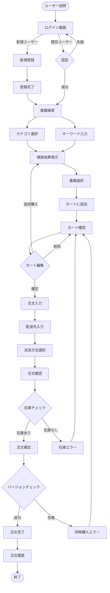
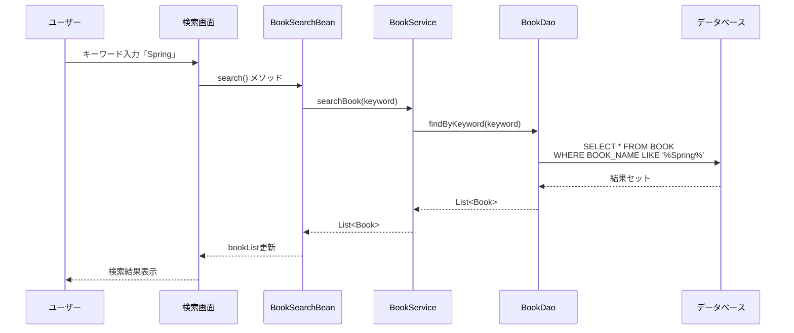
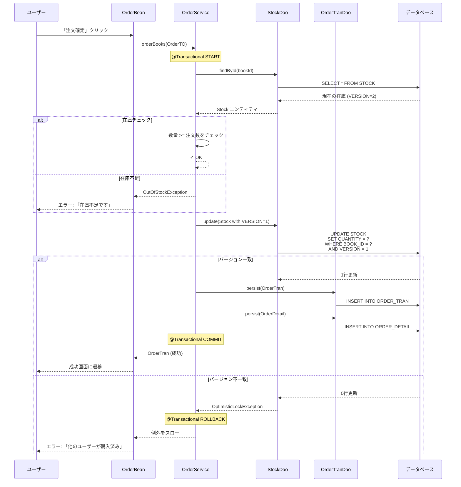
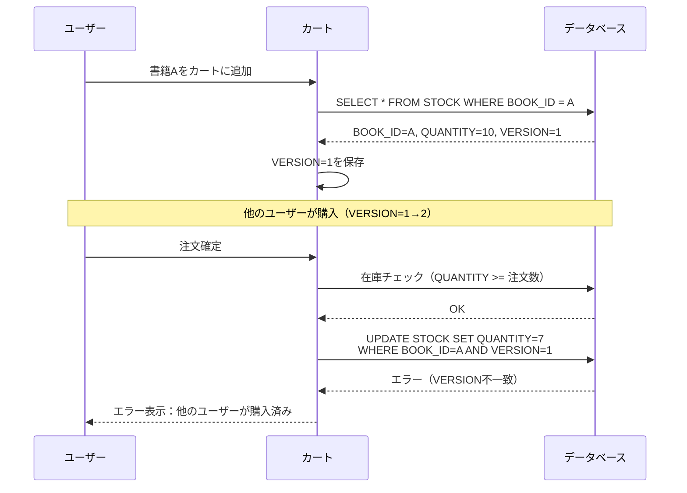
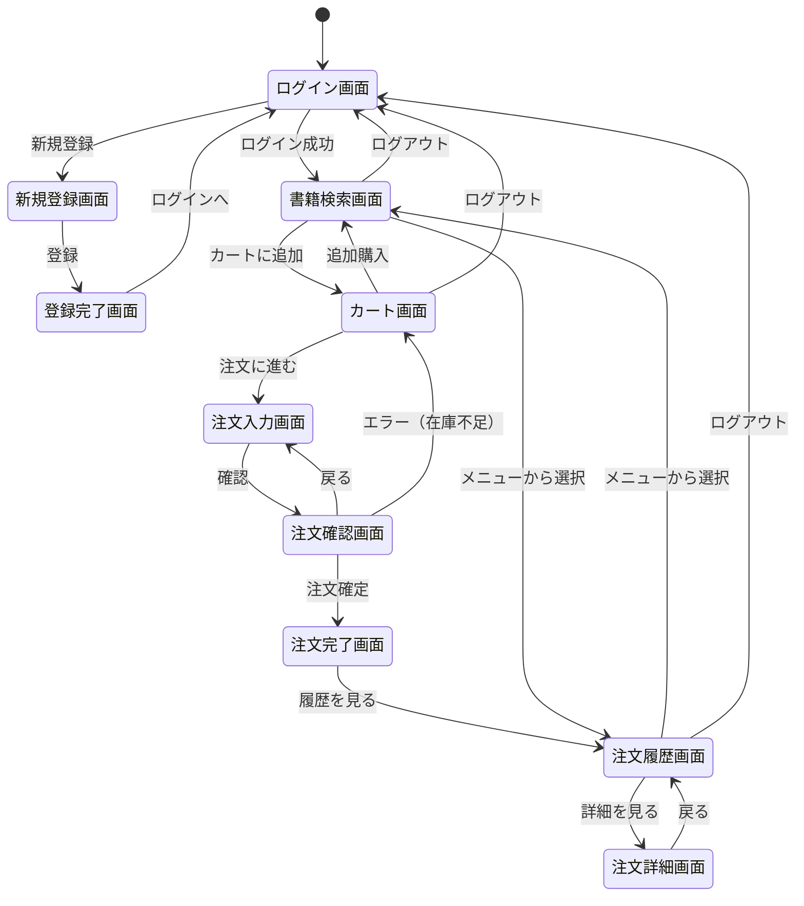
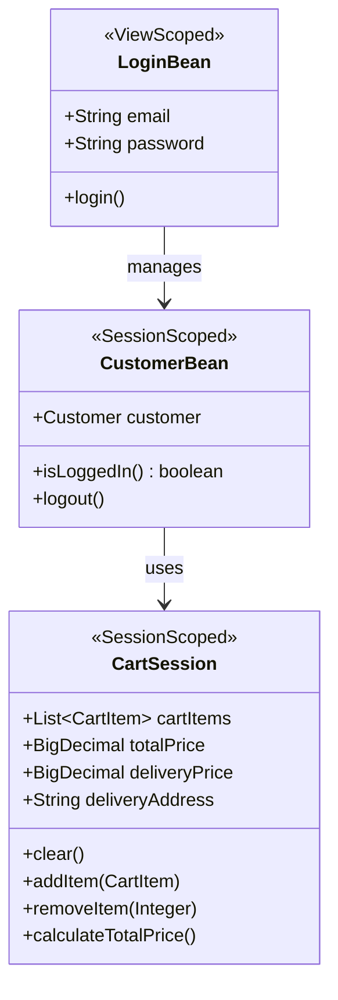

# berry-books - 機能設計書

**プロジェクトID:** 001-berry-books  
**バージョン:** 1.1.0  
**最終更新日:** 2025-12-14  
**ステータス:** 機能設計完了

---

## 1. 概要

本文書は、berry-booksシステムの各機能の詳細設計を記述します。各機能について、ユーザーストーリー、ビジネスルール、ユーザーフロー、データフロー、画面遷移、エッジケース・エラーシナリオを定義します。

---

## 2. 機能詳細設計

### 2.1 機能 F-001: 書籍検索・閲覧

#### 2.1.1 ユーザーストーリー

```
As a 一般顧客
I want to カテゴリやキーワードで書籍を検索する
So that 目的の書籍を効率的に見つけることができる
```

#### 2.1.2 ビジネスルール

| ルールID | 説明 |
|---------|-------------|
| BR-001 | カテゴリ未選択の場合、全カテゴリが検索対象 |
| BR-002 | キーワード未入力の場合、書籍名と著者の両方を検索 |
| BR-003 | 検索結果は書籍ID昇順でソート |
| BR-004 | 在庫0の書籍も表示（購入不可） |

#### 2.1.3 機能フロー

**検索フロー:**
1. ユーザーがカテゴリを選択（任意）
2. ユーザーがキーワードを入力（任意）
3. 「検索」ボタンをクリック
4. システムがデータベースを検索
5. 検索結果を一覧表示

**表示ルール:**
- 在庫0の書籍は「在庫なし」と表示
- 各書籍について、書籍名、著者、出版社、価格、在庫状況を表示

#### 2.1.4 受入基準

詳細は [behaviors.md](behaviors.md#機能-31-書籍検索閲覧) を参照

---

### 2.2 機能 F-002: ショッピングカート管理

#### 2.2.1 ユーザーストーリー

```
As a 一般顧客
I want to 選択した書籍をカートに追加・管理する
So that 購入前に内容を確認・調整できる
```

#### 2.2.2 ビジネスルール

| ルールID | 説明 |
|---------|-------------|
| BR-010 | カート内容はセッション単位で保持（ログアウトまで） |
| BR-011 | 同じ書籍を追加した場合、数量を加算 |
| BR-012 | カート追加時点の在庫バージョン番号を保存（楽観的ロック用） |
| BR-013 | カート内の合計金額は常に自動計算 |

#### 2.2.3 機能フロー

**カート追加フロー:**
1. 検索結果から書籍を選択
2. 「カートに追加」ボタンをクリック
3. システムが在庫を確認
4. システムが在庫バージョン番号を保存
5. カートに書籍を追加
6. 合計金額を再計算

**カート編集フロー:**
1. カート画面で数量を変更
2. 「更新」ボタンをクリック
3. 合計金額を再計算

**カート削除フロー:**
1. カート画面で「削除」をチェック
2. 「更新」ボタンをクリック
3. カートから書籍を削除
4. 合計金額を再計算

#### 2.2.4 データ保持

**セッション保持項目:**
- 書籍ID
- 書籍名
- 出版社名
- 単価
- 数量
- 在庫バージョン番号
- 小計（単価 × 数量）

#### 2.2.5 受入基準

詳細は [behaviors.md](behaviors.md#機能-32-ショッピングカート管理) を参照

---

### 2.3 機能 F-003: 注文処理

#### 2.3.1 ユーザーストーリー

```
As a 一般顧客
I want to カート内の書籍を購入し、配送先と決済方法を指定する
So that 書籍を受け取ることができる
```

#### 2.3.2 ビジネスルール

| ルールID | 説明 | 詳細 |
|---------|-------------|---------|
| BR-020 | 配送料金計算ルール | 通常800円、沖縄県1700円、購入金額5000円以上で送料無料 |
| BR-021 | 決済方法選択肢 | 銀行振込、クレジットカード、着払い |
| BR-022 | 在庫チェックタイミング | 注文確定時に全書籍の在庫を確認 |
| BR-023 | 在庫減算タイミング | 在庫チェック後、注文登録前に減算 |
| BR-024 | 楽観的ロック制御 | カート追加時のバージョン番号で在庫更新 |
| BR-025 | トランザクション範囲 | 在庫チェック〜注文登録〜在庫減算は単一トランザクション |

#### 2.3.3 配送料金計算ルール

```
IF 購入金額 >= 5000円 THEN
    配送料金 = 0円（送料無料）
ELSE IF 配送先住所 が "沖縄県" で始まる THEN
    配送料金 = 1700円
ELSE
    配送料金 = 800円（通常配送）
END IF
```

#### 2.3.4 楽観的ロック制御

**フェーズ 1: カート追加時**
- 在庫エンティティからVERSION値を取得
- VERSION値をカートアイテムに保存

**フェーズ 2: 注文確定時**
- カートアイテムに保存したVERSION値で在庫を更新
- データベースのWHERE句に「AND VERSION = ?」条件を追加
- VERSION値が一致しない場合、OptimisticLockException発生
- 例外発生時、ユーザーにエラーメッセージを表示

**フェーズ 3: 正常時**
- 在庫数を減算
- VERSION値を自動インクリメント（JPA @Version機能）

#### 2.3.5 機能フロー

**注文入力フロー:**
1. カート画面で「注文に進む」ボタンをクリック
2. 注文入力画面に遷移
3. 配送先住所を入力
4. 決済方法を選択
5. システムが配送料金を自動計算
6. 注文内容を確認

**注文確定フロー:**
1. 「注文確定」ボタンをクリック
2. システムがトランザクション開始
3. システムが在庫を確認
4. システムが楽観的ロックで在庫を更新
5. システムが注文トランザクションを作成
6. システムが注文明細を作成
7. システムがトランザクションをコミット
8. 注文完了画面に遷移

#### 2.3.6 受入基準

詳細は [behaviors.md](behaviors.md#機能-33-注文処理) を参照

---

### 2.4 機能 F-004: 顧客管理・認証

#### 2.4.1 ユーザーストーリー

```
As a 新規顧客
I want to アカウントを登録してログインする
So that 書籍を購入し、注文履歴を管理できる
```

#### 2.4.2 ビジネスルール

| ルールID | 説明 |
|---------|-------------|
| BR-030 | メールアドレスは一意（重複不可） |
| BR-031 | パスワードは平文保存（学習用のみ、本番環境では非推奨） |
| BR-032 | セッションタイムアウト: 60分 |
| BR-033 | 公開ページ: ログイン画面、新規登録画面、登録完了画面 |
| BR-034 | 公開ページ以外は認証必須 |

#### 2.4.3 機能フロー

**新規登録フロー:**
1. ログイン画面で「新規登録」リンクをクリック
2. 新規登録画面に遷移
3. 顧客情報を入力（氏名、メールアドレス、パスワード）
4. 「登録」ボタンをクリック
5. システムがメールアドレスの重複をチェック
6. システムが顧客情報を登録
7. 登録完了画面に遷移

**ログインフロー:**
1. ログイン画面でメールアドレスとパスワードを入力
2. 「ログイン」ボタンをクリック
3. システムが認証情報を確認
4. 認証成功の場合、書籍検索画面に遷移
5. 認証失敗の場合、エラーメッセージを表示

**ログアウトフロー:**
1. 「ログアウト」リンクをクリック
2. システムがセッションをクリア
3. ログイン画面に遷移

#### 2.4.4 受入基準

詳細は [behaviors.md](behaviors.md#機能-34-顧客管理認証) を参照

---

### 2.5 機能 F-005: 注文履歴参照

#### 2.5.1 ユーザーストーリー

```
As a 登録顧客
I want to 過去の注文履歴を確認する
So that 購入済み書籍と配送状況を把握できる
```

#### 2.5.2 ビジネスルール

| ルールID | 説明 |
|---------|-------------|
| BR-040 | 注文履歴は顧客IDでフィルタリング |
| BR-041 | 注文日降順（新しい順）でソート |
| BR-042 | 注文詳細は注文IDで取得 |

#### 2.5.3 機能フロー

**注文履歴一覧表示フロー:**
1. メニューから「注文履歴」を選択
2. システムがログイン中の顧客の注文履歴を取得
3. 注文履歴を注文日降順で一覧表示

**注文詳細表示フロー:**
1. 注文履歴一覧から注文を選択
2. 注文詳細画面に遷移
3. 注文情報、配送先情報、注文明細を表示

**表示項目:**
- 注文番号
- 注文日
- 合計金額
- 配送料金
- 配送先住所
- 決済方法
- 注文明細（書籍名、単価、数量、小計）

#### 2.5.4 受入基準

詳細は [behaviors.md](behaviors.md#機能-35-注文履歴参照) を参照

---

## 3. ユーザーフロー

### 3.1 メインユーザーフロー: 書籍購入フロー



---

## 4. データフロー

### 4.1 書籍検索データフロー



### 4.2 注文処理データフロー（楽観的ロック付き）



### 4.3 楽観的ロックフロー



---

## 5. 画面遷移

### 5.1 画面遷移図



### 5.2 画面一覧

| 画面ID | 画面名 | ファイル名 | 認証 |
|--------|--------|-----------|------|
| SC-001 | ログイン画面 | index.xhtml | 不要 |
| SC-002 | 新規登録画面 | customerInput.xhtml | 不要 |
| SC-003 | 登録完了画面 | customerOutput.xhtml | 不要 |
| SC-004 | 書籍検索画面 | bookSearch.xhtml | 必要 |
| SC-005 | カート画面 | cart.xhtml | 必要 |
| SC-006 | 注文入力画面 | orderInput.xhtml | 必要 |
| SC-007 | 注文確認画面 | orderConfirm.xhtml | 必要 |
| SC-008 | 注文完了画面 | orderComplete.xhtml | 必要 |
| SC-009 | 注文履歴画面 | orderHistory.xhtml | 必要 |
| SC-010 | 注文詳細画面 | orderDetail.xhtml | 必要 |

---

## 6. エッジケース＆エラーシナリオ

### 6.1 在庫管理

| シナリオ | 期待される動作 |
|----------|-------------------|
| 在庫0の書籍を検索 | 検索結果に表示、カート追加不可 |
| カート追加後に在庫0になった | 注文時に在庫不足エラー |
| 複数ユーザーが同時購入 | 先着順、後続ユーザーはエラー |
| 在庫数より多い数量を注文 | 注文確定時にエラー |

### 6.2 認証・セッション

| シナリオ | 期待される動作 |
|----------|-------------------|
| セッションタイムアウト | ログイン画面にリダイレクト |
| 直接URL入力（未ログイン） | ログイン画面にリダイレクト |
| ログアウト後のブラウザバック | ログイン画面にリダイレクト |
| 重複ログイン | 最新のセッションのみ有効 |

### 6.3 カート操作

| シナリオ | 期待される動作 |
|----------|-------------------|
| 空カートで注文画面へ遷移 | エラーメッセージ表示 |
| カート内の書籍が削除された | 注文時にエラー |
| カート内の価格が変更された | カート追加時の価格で注文 |

### 6.4 入力検証

| シナリオ | 期待される動作 |
|----------|-------------------|
| 必須項目未入力 | 検証エラーメッセージ表示 |
| メールアドレス形式不正 | 検証エラーメッセージ表示 |
| 重複メールアドレスで登録 | ビジネスエラーメッセージ表示 |
| 不正な数量（0以下） | 検証エラーメッセージ表示 |

---

## 7. エラーメッセージ一覧

### 7.1 検証エラー

| エラーコード | メッセージ | 発生条件 |
|-------------|-----------|---------|
| VAL-001 | メールアドレスを入力してください | メールアドレス未入力 |
| VAL-002 | パスワードを入力してください | パスワード未入力 |
| VAL-003 | 配送先住所を入力してください | 住所未入力 |
| VAL-004 | 数量は1以上を入力してください | 数量が0以下 |

### 7.2 ビジネスエラー

| エラーコード | メッセージ | 発生条件 |
|-------------|-----------|---------|
| BIZ-001 | メールアドレスが既に登録されています | メールアドレス重複 |
| BIZ-002 | メールアドレスまたはパスワードが正しくありません | 認証失敗 |
| BIZ-003 | 在庫が不足しています | 在庫不足 |
| BIZ-004 | 他のユーザーが購入済みです。カートを確認してください | 楽観的ロック競合 |
| BIZ-005 | カートが空です | 空カートで注文 |

### 7.3 システムエラー

| エラーコード | メッセージ | 発生条件 |
|-------------|-----------|---------|
| SYS-001 | システムエラーが発生しました | 予期しないエラー |
| SYS-002 | データベース接続エラー | DB接続失敗 |
| SYS-003 | トランザクションエラー | トランザクション失敗 |

---

## 8. クラス設計

### 8.1 主要クラスの責務

本システムの主要クラスとその責務を以下に示します。

#### 8.1.1 共通ユーティリティ (common/)

**MessageUtil**
- **責務**: メッセージリソース（messages.properties）からメッセージを取得
- **タイプ**: ユーティリティクラス（final、static メソッド）
- **主要メソッド**: 
  - `get(String key)` - キーからメッセージを取得
  - `get(String key, Object... params)` - パラメータ付きメッセージを取得

**SettlementType**
- **責務**: 決済方法を表す定数とユーティリティメソッドを提供
- **タイプ**: Enum（列挙型）
- **定数**: 
  - BANK_TRANSFER(1) - 銀行振込
  - CREDIT_CARD(2) - クレジットカード
  - CASH_ON_DELIVERY(3) - 着払い
- **主要メソッド**: 
  - `fromCode(Integer)` - コードから列挙値を取得
  - `getDisplayNameByCode(Integer)` - コードから表示名を取得
  - `getAllCodes()` - 全コードのリストを取得

#### 8.1.2 プレゼンテーション層 (web/)

**SearchParam**
- **責務**: 書籍検索パラメータを保持
- **タイプ**: DTOクラス（Data Transfer Object）
- **フィールド**: 
  - `categoryId` - カテゴリID
  - `keyword` - 検索キーワード

**CartItem**
- **責務**: カート内の書籍情報を保持
- **タイプ**: DTOクラス（Serializable）
- **フィールド**: 
  - `bookId` - 書籍ID
  - `bookName` - 書籍名
  - `publisherName` - 出版社名
  - `price` - 単価
  - `count` - 数量
  - `version` - 在庫バージョン番号（楽観的ロック用）
  - `remove` - 削除フラグ

**CartSession**
- **責務**: セッションスコープでカート状態を管理
- **タイプ**: @SessionScoped Bean
- **フィールド**: 
  - `cartItems` - カートアイテムのリスト
  - `totalPrice` - 合計金額
  - `deliveryPrice` - 配送料金
  - `deliveryAddress` - 配送先住所
- **主要メソッド**: 
  - `clear()` - カートをクリア
  - `addItem(CartItem)` - カートにアイテムを追加
  - `removeItem(Integer bookId)` - カートからアイテムを削除
  - `calculateTotalPrice()` - 合計金額を計算

**BookSearchBean**
- **責務**: 書籍検索画面のコントローラー
- **タイプ**: @ViewScoped Bean
- **フィールド**: 
  - `searchParam` - 検索パラメータ
  - `bookList` - 検索結果のリスト
  - `categoryList` - カテゴリリスト
- **主要メソッド**: 
  - `search()` - 書籍検索を実行
  - `addToCart(Book)` - カートに追加

**CartBean**
- **責務**: カート画面のコントローラー
- **タイプ**: @ViewScoped Bean
- **フィールド**: 
  - `cartSession` - カートセッション
- **主要メソッド**: 
  - `updateCart()` - カート内容を更新
  - `proceedToOrder()` - 注文画面に進む

**OrderBean**
- **責務**: 注文処理のコントローラー
- **タイプ**: @ViewScoped Bean
- **フィールド**: 
  - `orderTO` - 注文転送オブジェクト
  - `cartSession` - カートセッション
- **主要メソッド**: 
  - `calculateDeliveryFee()` - 配送料金を計算
  - `confirmOrder()` - 注文を確認
  - `placeOrder()` - 注文を確定

**CustomerBean**
- **責務**: 顧客情報とログイン状態を管理
- **タイプ**: @SessionScoped Bean
- **フィールド**: 
  - `customer` - 顧客エンティティ
- **主要メソッド**: 
  - `isLoggedIn()` - ログイン状態を確認
  - `logout()` - ログアウト

**LoginBean**
- **責務**: ログイン処理のコントローラー
- **タイプ**: @ViewScoped Bean
- **フィールド**: 
  - `email` - メールアドレス
  - `password` - パスワード
- **主要メソッド**: 
  - `login()` - ログイン処理
  - `navigateToRegister()` - 新規登録画面に遷移

#### 8.1.3 ビジネスロジック層 (service/)

**BookService**
- **責務**: 書籍検索のビジネスロジック
- **タイプ**: @ApplicationScoped
- **主要メソッド**: 
  - `searchBook(SearchParam)` - 書籍を検索
  - `findBookById(Integer)` - 書籍IDで検索
  - `getAllCategories()` - 全カテゴリを取得

**CategoryService**
- **責務**: カテゴリ管理のビジネスロジック
- **タイプ**: @ApplicationScoped
- **主要メソッド**: 
  - `findAll()` - 全カテゴリを取得
  - `findById(Integer)` - カテゴリIDで検索

**CustomerService**
- **責務**: 顧客管理のビジネスロジック
- **タイプ**: @ApplicationScoped
- **主要メソッド**: 
  - `register(Customer)` - 顧客を登録
  - `authenticate(String email, String password)` - 認証
  - `findByEmail(String)` - メールアドレスで検索

**DeliveryFeeService**
- **責務**: 配送料金計算のビジネスロジック
- **タイプ**: @ApplicationScoped
- **主要メソッド**: 
  - `calculateDeliveryFee(BigDecimal totalPrice, String address)` - 配送料金を計算

**OrderService**
- **責務**: 注文処理のビジネスロジック
- **タイプ**: @ApplicationScoped
- **主要メソッド**: 
  - `orderBooks(OrderTO)` - 注文を作成（@Transactional）
  - `getOrderHistory(Integer customerId)` - 注文履歴を取得
  - `getOrderDetail(Long orderTranId)` - 注文詳細を取得

#### 8.1.4 転送オブジェクト (DTO/TO)

**OrderTO**
- **責務**: 注文情報をレイヤー間で転送
- **タイプ**: Transfer Object
- **フィールド**: 
  - `customerId` - 顧客ID
  - `deliveryAddress` - 配送先住所
  - `deliveryPrice` - 配送料金
  - `settlementCode` - 決済方法コード
  - `cartItems` - カートアイテムのリスト

**OrderHistoryTO**
- **責務**: 注文履歴情報をレイヤー間で転送
- **タイプ**: Transfer Object
- **フィールド**: 
  - `orderTranId` - 注文ID
  - `orderDate` - 注文日
  - `totalPrice` - 合計金額
  - `deliveryPrice` - 配送料金
  - `settlementName` - 決済方法名

**OrderSummaryTO**
- **責務**: 注文サマリー情報をレイヤー間で転送
- **タイプ**: Transfer Object
- **フィールド**: 
  - `orderTran` - 注文トランザクション
  - `orderDetails` - 注文明細のリスト

#### 8.1.5 データアクセス層 (dao/)

**BookDao**
- **責務**: 書籍エンティティのCRUD操作
- **タイプ**: @ApplicationScoped
- **主要メソッド**: 
  - `findAll()` - 全書籍を取得
  - `findById(Integer)` - 書籍IDで検索
  - `findByKeyword(String)` - キーワードで検索
  - `findByCategoryAndKeyword(Integer, String)` - カテゴリとキーワードで検索

**CategoryDao**
- **責務**: カテゴリエンティティのCRUD操作
- **タイプ**: @ApplicationScoped
- **主要メソッド**: 
  - `findAll()` - 全カテゴリを取得
  - `findById(Integer)` - カテゴリIDで検索

**CustomerDao**
- **責務**: 顧客エンティティのCRUD操作
- **タイプ**: @ApplicationScoped
- **主要メソッド**: 
  - `persist(Customer)` - 顧客を登録
  - `findByEmail(String)` - メールアドレスで検索

**StockDao**
- **責務**: 在庫エンティティのCRUD操作（楽観的ロック付き）
- **タイプ**: @ApplicationScoped
- **主要メソッド**: 
  - `findById(Integer)` - 書籍IDで在庫を検索
  - `update(Stock)` - 在庫を更新（@Version付き）

**OrderTranDao**
- **責務**: 注文トランザクションエンティティのCRUD操作
- **タイプ**: @ApplicationScoped
- **主要メソッド**: 
  - `persist(OrderTran)` - 注文トランザクションを登録
  - `findByCustomerId(Integer)` - 顧客IDで注文履歴を取得
  - `findById(Long)` - 注文IDで検索

**OrderDetailDao**
- **責務**: 注文明細エンティティのCRUD操作
- **タイプ**: @ApplicationScoped
- **主要メソッド**: 
  - `persist(OrderDetail)` - 注文明細を登録
  - `findByOrderTranId(Long)` - 注文IDで明細を取得

### 8.2 セッション状態設計

セッションスコープで管理される主要なBeanの構造を以下に示します。



---

## 9. 改訂履歴

| バージョン | 日付 | 作成者 | 変更内容 |
|-----------|------|--------|---------|
| 1.0.0 | 2025-12-14 | System | 機能設計書を新規作成（spec.mdから再編成） |
| 1.1.0 | 2025-12-14 | System | クラス設計セクションを追加（technical-design.mdから移動） |
| 1.1.1 | 2025-12-14 | System | ドキュメント説明を更新（基本設計書としての位置づけ明確化） |

---

**ドキュメント終了**

*この機能設計書（基本設計書）は、システムの各機能の詳細設計とクラス設計を記述しています。要件の概要は requirements.md、アーキテクチャ設計は architecture.md を参照してください。*

