# berry-books - ワイヤーフレーム仕様

**Feature ID:** 001-berry-books  
**Version:** 1.0.0  
**Last Updated:** 2025-12-13  
**Format:** PlantUML (draw.io インポート可能)

---

## 使用方法

### PlantUMLレンダリング
各ワイヤーフレームは PlantUML の `salt` 記法で記述されています。

**レンダリング方法：**
1. [PlantUML Online Editor](https://www.plantuml.com/plantuml/uml/)
2. VS Code PlantUML拡張機能
3. draw.io（File → Import → PlantUML）

### draw.ioへのインポート
```
1. draw.ioを開く
2. File → Import from → Text
3. 以下のPlantUMLコードをコピー＆ペースト
4. 必要に応じて編集
```

---

## 画面一覧

1. [ログイン画面 (index.xhtml)](#1-ログイン画面)
2. [新規登録画面 (customerInput.xhtml)](#2-新規登録画面)
3. [書籍検索画面 (bookSearch.xhtml)](#3-書籍検索画面)
4. [検索結果画面 (bookSelect.xhtml)](#4-検索結果画面)
5. [カート確認画面 (cartView.xhtml)](#5-カート確認画面)
6. [注文入力画面 (bookOrder.xhtml)](#6-注文入力画面)
7. [注文完了画面 (orderSuccess.xhtml)](#7-注文完了画面)
8. [注文履歴画面 (orderHistory.xhtml)](#8-注文履歴画面)

---

## 1. ログイン画面

**ファイル名:** `index.xhtml`  
**目的:** ユーザー認証

### PlantUML

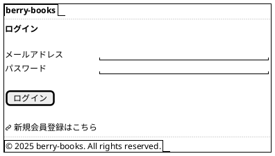

### レイアウト説明

| エリア | コンポーネント | 説明 |
|--------|--------------|------|
| ヘッダー | タイトル | "berry-books" |
| メインコンテンツ | ログインフォーム | メールアドレス、パスワード入力欄 |
| | ログインボタン | 認証実行 |
| | 新規登録リンク | customerInput.xhtmlへ遷移 |
| フッター | コピーライト | 著作権表示 |

### バリデーション

- メールアドレス：必須、Email形式
- パスワード：必須

---

## 2. 新規登録画面

**ファイル名:** `customerInput.xhtml`  
**目的:** 新規顧客登録

### PlantUML

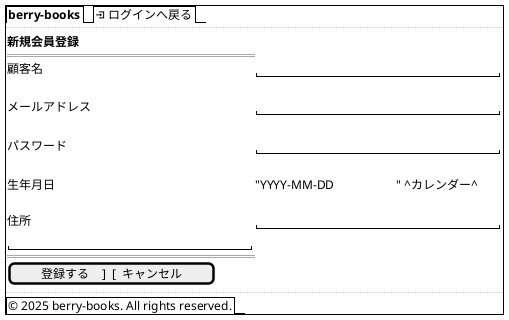

### レイアウト説明

| フィールド | タイプ | バリデーション |
|----------|--------|--------------|
| 顧客名 | テキスト | 必須、最大30文字 |
| メールアドレス | Email | 必須、Email形式、重複不可 |
| パスワード | Password | 必須、最大60文字 |
| 生年月日 | Date | 任意、日付形式 |
| 住所 | TextArea | 任意、最大120文字 |

### 動作

- **登録ボタン**: CustomerBean.register() → customerOutput.xhtml
- **キャンセルボタン**: index.xhtmlへ戻る

---

## 3. 書籍検索画面

**ファイル名:** `bookSearch.xhtml`  
**目的:** 書籍検索条件入力

### PlantUML

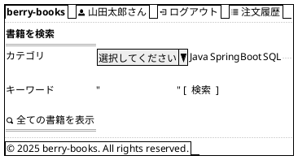

### レイアウト説明

| エリア | コンポーネント | 説明 |
|--------|--------------|------|
| ヘッダー | サイト名 | "berry-books" |
| | ユーザー名 | ログイン中の顧客名 |
| | ログアウトリンク | セッション破棄 |
| | 注文履歴リンク | orderHistory.xhtmlへ |
| 検索フォーム | カテゴリドロップダウン | 全カテゴリ + 未選択 |
| | キーワード入力 | 書籍名・著者名検索 |
| | 検索ボタン | bookSelect.xhtmlへ |
| | 全書籍表示リンク | 検索条件なしで全表示 |

### 検索ロジック

```
IF カテゴリ選択 AND キーワード入力
  → カテゴリ + キーワード複合検索
ELSE IF カテゴリ選択のみ
  → カテゴリ検索
ELSE IF キーワード入力のみ
  → キーワード検索
ELSE
  → 全書籍取得
```

---

## 4. 検索結果画面

**ファイル名:** `bookSelect.xhtml`  
**目的:** 検索結果一覧表示とカート追加

### PlantUML

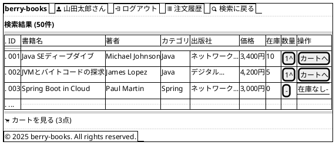

### レイアウト説明

| カラム | 説明 | 幅 |
|--------|------|-----|
| ID | 書籍ID | 固定50px |
| 書籍名 | 書籍タイトル | 可変 |
| 著者 | 著者名 | 150px |
| カテゴリ | カテゴリ名 | 100px |
| 出版社 | 出版社名（省略表示） | 150px |
| 価格 | カンマ区切り | 80px |
| 在庫 | 在庫数 | 50px |
| 数量 | スピナー入力 | 60px |
| 操作 | カート追加ボタン | 100px |

### 動作

- **カートへボタン**: CartBean.addBook(bookId, count) → cartView.xhtml
- **在庫なし**: ボタン無効化、グレー表示
- **カートを見るリンク**: cartView.xhtmlへ遷移

---

## 5. カート確認画面

**ファイル名:** `cartView.xhtml`  
**目的:** カート内容確認・編集

### PlantUML

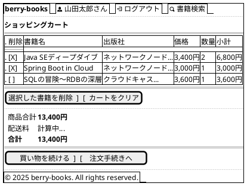

### レイアウト説明

| エリア | コンポーネント | 説明 |
|--------|--------------|------|
| カートテーブル | 削除チェックボックス | 複数選択可能 |
| | 書籍情報 | 書籍名、出版社、価格 |
| | 数量 | 表示のみ（変更不可） |
| | 小計 | 単価 × 数量 |
| 操作ボタン | 選択削除 | チェックした書籍を削除 |
| | カートクリア | 全削除 |
| 価格サマリー | 商品合計 | カート内商品の合計 |
| | 配送料 | 注文手続き時に計算 |
| | 合計 | 商品合計 + 配送料 |
| ナビゲーション | 買い物を続ける | bookSearch.xhtmlへ |
| | 注文手続きへ | bookOrder.xhtmlへ |

### 動作

- **選択削除**: CartBean.removeSelectedBooks() → 再表示
- **カートクリア**: CartBean.clearCart() → cartClear.xhtml
- **注文手続きへ**: CartBean.proceedToOrder() → bookOrder.xhtml
  - 配送先住所を顧客住所から設定
  - 配送料金を計算

---

## 6. 注文入力画面

**ファイル名:** `bookOrder.xhtml`  
**目的:** 配送先・決済方法入力

### PlantUML

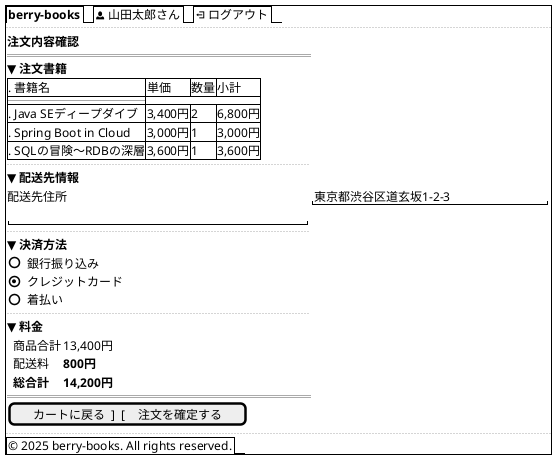

### レイアウト説明

| セクション | コンポーネント | 説明 |
|----------|--------------|------|
| 注文書籍 | 読み取り専用テーブル | カート内容の確認表示 |
| 配送先情報 | テキストエリア | 編集可能、デフォルトは顧客住所 |
| 決済方法 | ラジオボタン | 銀行振込/クレジット/着払い |
| 料金サマリー | 商品合計 | カート合計金額 |
| | 配送料 | 自動計算（800円/1700円/0円） |
| | 総合計 | 商品合計 + 配送料 |

### 配送料金計算ルール

```
IF 商品合計 >= 5,000円
  → 配送料 = 0円（送料無料）
ELSE IF 配送先住所 が "沖縄県" で始まる
  → 配送料 = 1,700円
ELSE
  → 配送料 = 800円
```

### 動作

- **カートに戻る**: cartView.xhtmlへ遷移
- **注文を確定する**: OrderBean.placeOrder()
  - 成功 → orderSuccess.xhtml
  - 在庫不足 → エラーメッセージ表示、同画面に留まる
  - 楽観的ロック競合 → エラーメッセージ表示

---

## 7. 注文完了画面

**ファイル名:** `orderSuccess.xhtml`  
**目的:** 注文確定完了通知

### PlantUML

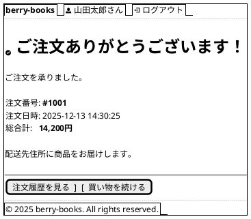

### レイアウト説明

| エリア | 内容 |
|--------|------|
| メッセージ | 注文完了の確認メッセージ |
| 注文情報 | 注文番号、注文日時、総合計 |
| ナビゲーション | 注文履歴/書籍検索へのリンク |

---

## 8. 注文履歴画面

**ファイル名:** `orderHistory.xhtml`  
**目的:** 過去の注文一覧表示

### PlantUML

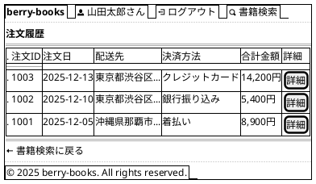

### レイアウト説明

| カラム | 説明 |
|--------|------|
| 注文ID | 注文取引ID |
| 注文日 | 注文確定日 |
| 配送先 | 配送先住所（省略表示） |
| 決済方法 | 銀行振込/クレジット/着払い |
| 合計金額 | 商品合計 + 配送料 |
| 詳細 | 注文詳細ボタン → orderDetail.xhtml |

### 動作

- **詳細ボタン**: orderDetail.xhtml?orderId=XXX へ遷移
- ソート順: 注文日降順（新しい順）

---

## 9. 注文詳細画面

**ファイル名:** `orderDetail.xhtml`  
**目的:** 注文の詳細情報表示

### PlantUML

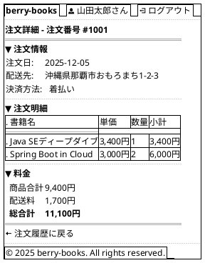

---

## 10. エラー画面

**ファイル名:** `orderError.xhtml`  
**目的:** 注文エラー表示

### PlantUML

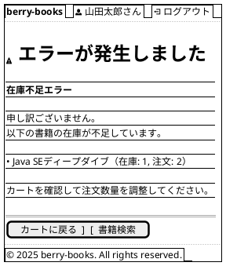

### エラーメッセージパターン

| エラー種別 | メッセージ |
|----------|----------|
| 在庫不足 | "在庫が不足しています。書籍名（在庫: X, 注文: Y）" |
| 楽観的ロック競合 | "他のユーザーが同時に購入しました。カートを確認してください。" |
| 空カート | "カートに商品がありません。" |

---

## 11. 共通UI要素

### ヘッダーコンポーネント

```plantuml
@startsalt
{
  {/ <b>berry-books</b> | <&person> ユーザー名 | <&account-logout> ログアウト | <&magnifying-glass> 検索 | <&list> 履歴 | <&cart> カート(N) }
}
@endsalt
```

### フッターコンポーネント


### カラースキーム

| 要素 | カラーコード | 用途 |
|------|------------|------|
| プライマリー | #CF3F4E | ボタン、リンク、ヘッダー |
| セカンダリー | #E8E8E8 | 背景、ボーダー |
| テキスト | #333333 | 本文 |
| エラー | #D32F2F | エラーメッセージ |
| 成功 | #388E3C | 成功メッセージ |
| 警告 | #F57C00 | 警告メッセージ |

---

## 12. レスポンシブブレークポイント

| デバイス | ブレークポイント | レイアウト |
|---------|----------------|-----------|
| デスクトップ | > 1024px | 横幅最大1200px、中央寄せ |
| タブレット | 768px - 1024px | 横幅100%、パディング20px |
| モバイル | < 768px | スタック表示、横スクロール |

---

## 13. アクセシビリティ要件

| 要件 | 実装 |
|------|------|
| キーボードナビゲーション | Tab順序の最適化 |
| スクリーンリーダー対応 | 適切なARIAラベル |
| コントラスト比 | WCAG AA準拠（4.5:1以上） |
| フォーカス表示 | 明確なアウトライン |

---

## 付録: PlantUML 参考情報

### salt記法の基本

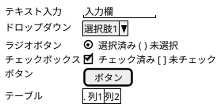

### draw.ioへのインポート手順

1. draw.ioを開く
2. **File** → **Import from** → **Text**
3. **PlantUML**を選択
4. 上記のPlantUMLコードを貼り付け
5. **Insert**をクリック

---

**Document End**

*このワイヤーフレーム仕様は、PlantUML形式で記述されており、draw.ioにインポート可能です。AIが理解しやすく、実装時の参照として使用できます。*

