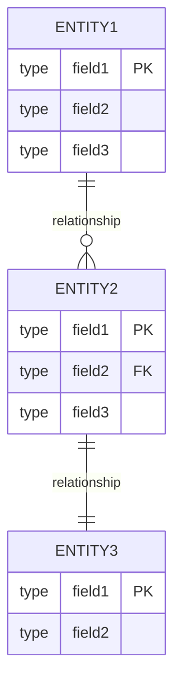
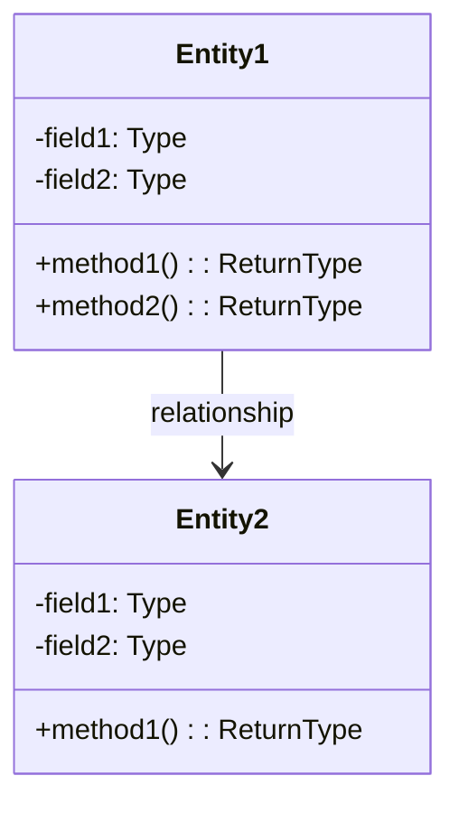

# [PROJECT_NAME] - データモデル仕様

**Feature ID:** [FEATURE_ID]  
**Version:** 1.0.0  
**Last Updated:** [DATE]  
**Status:** [STATUS]

---

## 1. エンティティ関係図



---

## 2. ドメインモデル



---

## 3. テーブル定義

### 3.1 [TABLE_NAME_1] ([テーブル名])

**目的:** [テーブルの目的と説明]

| カラム | 型 | 制約 | 説明 |
|--------|------|-------------|-------------|
| [COLUMN_NAME_1] | [TYPE] | PRIMARY KEY, IDENTITY | [説明]（自動採番） |
| [COLUMN_NAME_2] | [TYPE] | NOT NULL | [説明] |
| [COLUMN_NAME_3] | [TYPE] | NULL | [説明] |

**外部キー:**
- `[COLUMN_NAME]` → `[REF_TABLE]([REF_COLUMN])`

**ビジネスルール:**
- [ルール1]
- [ルール2]

**サンプルデータ:**
```
[サンプルデータの例]
```

**インデックス:**
- PRIMARY KEY: `[COLUMN_NAME]`
- UNIQUE KEY: `[COLUMN_NAME]`
- INDEX: `[COLUMN_NAME]`

**外部キー制約:**
- `[FK_NAME]`: `[COLUMN]` → `[REF_TABLE]([REF_COLUMN])`

---

### 3.2 [TABLE_NAME_2]

[必要に応じてテーブルを追加]

---

## 4. エンティティクラス仕様

### 4.1 [ENTITY_CLASS_NAME_1]

**パッケージ:** `[package.name]`  
**クラス名:** `[ClassName]`  
**テーブルマッピング:** `[TABLE_NAME]`

**フィールド:**

| フィールド名 | 型 | アノテーション | 説明 |
|------------|-----|-------------|------|
| [fieldName1] | [Type] | @Id, @GeneratedValue | [説明] |
| [fieldName2] | [Type] | @Column(name="...") | [説明] |
| [fieldName3] | [Type] | @ManyToOne | [説明] |

**リレーションシップ:**
- `@ManyToOne`: [RelatedEntity] ([説明])
- `@OneToMany`: [RelatedEntity] ([説明])

**制約:**
- `@NotNull`
- `@Size(min=X, max=Y)`
- `@Email`

---

### 4.2 [ENTITY_CLASS_NAME_2]

[必要に応じてエンティティを追加]

---

## 5. データ整合性ルール

### 5.1 トランザクション整合性

| ルール | 説明 | 実装方法 |
|--------|------|---------|
| [RULE_1] | [DESCRIPTION] | [IMPLEMENTATION] |
| [RULE_2] | [DESCRIPTION] | [IMPLEMENTATION] |

### 5.2 参照整合性

| 関係 | カスケードルール | 説明 |
|------|--------------|------|
| [TABLE1] → [TABLE2] | [CASCADE/RESTRICT/SET NULL] | [説明] |
| [TABLE2] → [TABLE3] | [CASCADE/RESTRICT/SET NULL] | [説明] |

---

## 6. サンプルデータ（最小セット）

### 6.1 マスタデータ ([TABLE_NAME_1])

```sql
INSERT INTO [TABLE_NAME_1] ([COLUMN1], [COLUMN2]) VALUES
([VALUE1], '[VALUE2]'),
([VALUE1], '[VALUE2]'),
([VALUE1], '[VALUE2]');
```

### 6.2 テストデータ (CUSTOMER例)

```sql
INSERT INTO CUSTOMER (CUSTOMER_ID, CUSTOMER_NAME, EMAIL, PASSWORD, BIRTHDAY, ADDRESS) VALUES
(1, 'Alice', 'alice@gmail.com', 'password', '1998-04-10', '東京都中央区1-1-1'),
(2, 'Bob', 'bob@gmail.com', 'password', '1988-05-10', '東京都杉並区2-2-2');
```

### 6.3 テストデータ (BOOK例)

```sql
INSERT INTO BOOK (BOOK_ID, BOOK_NAME, AUTHOR, CATEGORY_ID, PUBLISHER_ID, PRICE) VALUES
(1, 'Java SEディープダイブ', 'Michael Johnson', 1, 3, 3400),
(9, 'SpringBoot in Cloud', 'Paul Martin', 2, 3, 3000);
```

**注記:** 詳細なサンプルデータは実際のDMLスクリプトを参照する。
