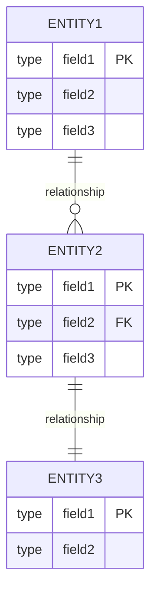
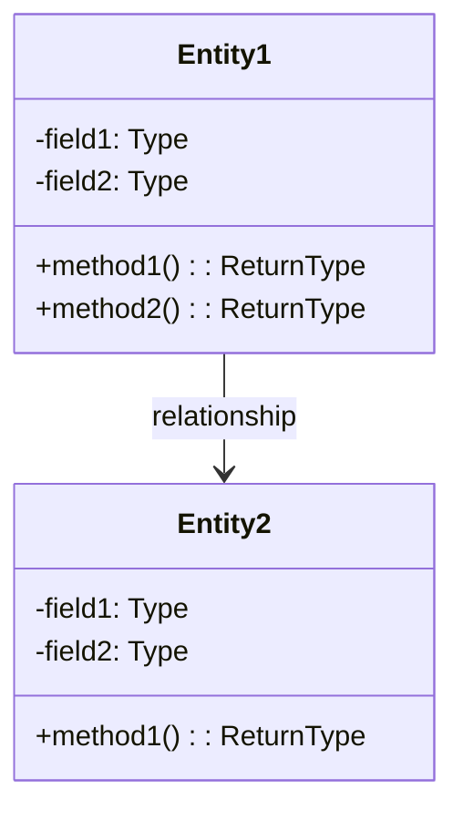

# [PROJECT_NAME] - データモデル仕様

**Feature ID:** [FEATURE_ID]  
**Version:** 1.0.0  
**Last Updated:** [DATE]  
**Status:** [STATUS]

---

## 1. エンティティ関係図



---

## 2. ドメインモデル



---

## 3. テーブル定義

### 3.1 [TABLE_NAME_1]

**テーブル概要:**  
[テーブルの目的と説明]

**物理テーブル名:** `[PHYSICAL_TABLE_NAME]`

| カラム名 | 物理名 | 型 | NULL | デフォルト | 制約 | 説明 |
|---------|-------|-----|------|-----------|------|------|
| [論理名1] | [物理名1] | [TYPE] | [YES/NO] | [DEFAULT] | PK | [説明] |
| [論理名2] | [物理名2] | [TYPE] | [YES/NO] | [DEFAULT] | FK | [説明] |
| [論理名3] | [物理名3] | [TYPE] | [YES/NO] | [DEFAULT] | - | [説明] |

**インデックス:**
- PRIMARY KEY: `[COLUMN_NAME]`
- UNIQUE KEY: `[COLUMN_NAME]`
- INDEX: `[COLUMN_NAME]`

**外部キー制約:**
- `[FK_NAME]`: `[COLUMN]` → `[REF_TABLE]([REF_COLUMN])`

---

### 3.2 [TABLE_NAME_2]

[必要に応じてテーブルを追加]

---

## 4. エンティティクラス仕様

### 4.1 [ENTITY_CLASS_NAME_1]

**パッケージ:** `[package.name]`  
**クラス名:** `[ClassName]`  
**テーブルマッピング:** `[TABLE_NAME]`

**フィールド:**

| フィールド名 | 型 | アノテーション | 説明 |
|------------|-----|-------------|------|
| [fieldName1] | [Type] | @Id, @GeneratedValue | [説明] |
| [fieldName2] | [Type] | @Column(name="...") | [説明] |
| [fieldName3] | [Type] | @ManyToOne | [説明] |

**リレーションシップ:**
- `@ManyToOne`: [RelatedEntity] ([説明])
- `@OneToMany`: [RelatedEntity] ([説明])

**制約:**
- `@NotNull`
- `@Size(min=X, max=Y)`
- `@Email`

---

### 4.2 [ENTITY_CLASS_NAME_2]

[必要に応じてエンティティを追加]

---

## 5. データ整合性ルール

### 5.1 トランザクション整合性

| ルール | 説明 | 実装方法 |
|--------|------|---------|
| [RULE_1] | [DESCRIPTION] | [IMPLEMENTATION] |
| [RULE_2] | [DESCRIPTION] | [IMPLEMENTATION] |

### 5.2 参照整合性

| 関係 | カスケードルール | 説明 |
|------|--------------|------|
| [TABLE1] → [TABLE2] | [CASCADE/RESTRICT/SET NULL] | [説明] |
| [TABLE2] → [TABLE3] | [CASCADE/RESTRICT/SET NULL] | [説明] |

---

## 6. DDLスクリプト

### 6.1 テーブル作成

```sql
CREATE TABLE [TABLE_NAME] (
    [column1] [TYPE] PRIMARY KEY,
    [column2] [TYPE] NOT NULL,
    [column3] [TYPE],
    CONSTRAINT [FK_NAME] FOREIGN KEY ([column]) REFERENCES [REF_TABLE]([ref_column])
);

CREATE INDEX [INDEX_NAME] ON [TABLE_NAME]([column]);
```

### 6.2 初期データ

```sql
INSERT INTO [TABLE_NAME] ([column1], [column2], [column3]) VALUES
    ([value1], [value2], [value3]),
    ([value1], [value2], [value3]);
```

---

## 7. 改訂履歴

| バージョン | 日付 | 作成者 | 変更内容 |
|-----------|------|--------|---------|
| 1.0.0 | [DATE] | [AUTHOR] | データモデルを新規作成 |

---

**ドキュメント終了**

*このデータモデル仕様は、データベース設計とエンティティ設計を記述しています。機能詳細は functional-design.md、アーキテクチャは architecture.md を参照してください。*

