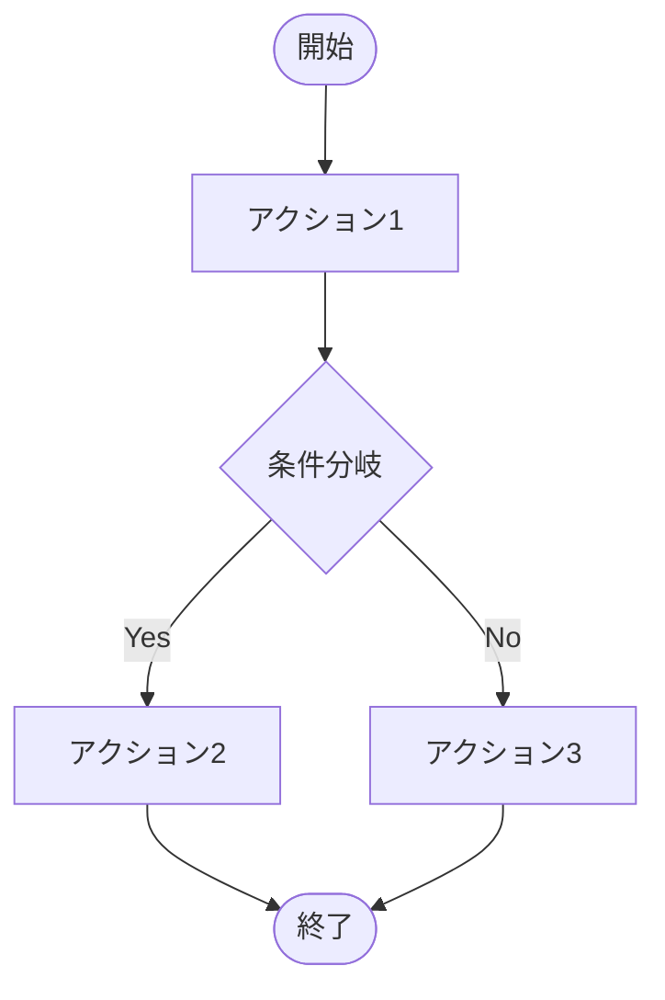
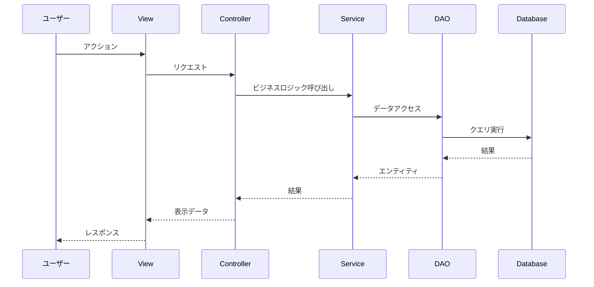
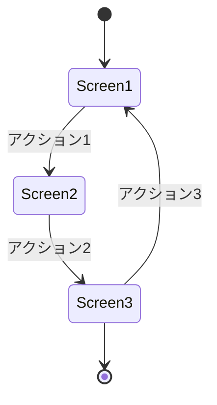
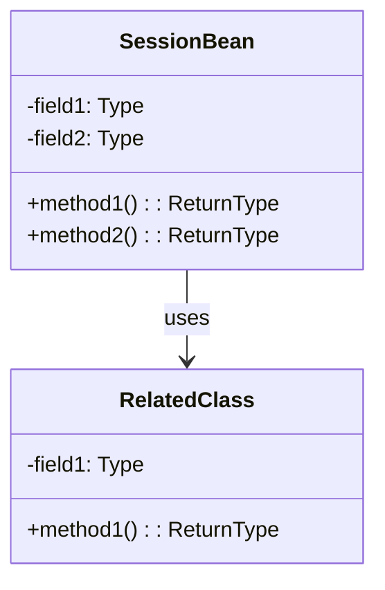

# [PROJECT_NAME] - 機能設計書

**プロジェクトID:** [PROJECT_ID]  
**バージョン:** 1.0.0  
**最終更新日:** [DATE]  
**ステータス:** [STATUS]

---

## 1. 概要

本文書は、[PROJECT_NAME]システムの各機能の詳細設計を記述する。各機能について、ユーザーストーリー、ビジネスルール、ユーザーフロー、データフロー、画面遷移、エッジケース・エラーシナリオを定義する。

---

## 2. 機能詳細設計

### 2.1 機能 [FEATURE_ID_1]: [FEATURE_NAME_1]

#### 2.1.1 ユーザーストーリー

```
As a [USER_ROLE]
I want to [ACTION]
So that [BENEFIT]
```

#### 2.1.2 ビジネスルール

| ルールID | 説明 |
|---------|-------------|
| BR-[XXX] | [ビジネスルールの説明] |
| BR-[XXX] | [ビジネスルールの説明] |

#### 2.1.3 機能フロー

**[フロー名1]:**
1. [ステップ1]
2. [ステップ2]
3. [ステップ3]

**[フロー名2]:**
1. [ステップ1]
2. [ステップ2]

#### 2.1.4 受入基準

詳細は [behaviors.md](behaviors.md#[ANCHOR]) を参照

---

### 2.2 機能 [FEATURE_ID_2]: [FEATURE_NAME_2]

[必要に応じて機能を追加]

---

## 3. ユーザーフロー

### 3.1 メインユーザーフロー



### 3.2 [サブフロー名]

[必要に応じて追加のフローを記述]

---

## 4. データフロー

### 4.1 [操作名] - シーケンス図



---

## 5. 画面遷移

### 5.1 画面遷移図



### 5.2 画面一覧

| 画面ID | 画面名 | ファイル名 | 認証要否 | 説明 |
|--------|--------|----------|---------|------|
| [ID_1] | [NAME] | [FILE] | [YES/NO] | [DESCRIPTION] |
| [ID_2] | [NAME] | [FILE] | [YES/NO] | [DESCRIPTION] |

### 5.3 ナビゲーションルール

| 遷移元 | イベント | 遷移先 | 条件 |
|--------|---------|--------|------|
| [FROM] | [EVENT] | [TO] | [CONDITION] |
| [FROM] | [EVENT] | [TO] | [CONDITION] |

---

## 6. エッジケース＆エラーシナリオ

### 6.1 データ整合性

| シナリオ | 期待される動作 |
|---------|--------------|
| [SCENARIO] | [EXPECTED_BEHAVIOR] |
| [SCENARIO] | [EXPECTED_BEHAVIOR] |

### 6.2 認証・セッション

| シナリオ | 期待される動作 |
|---------|--------------|
| [SCENARIO] | [EXPECTED_BEHAVIOR] |
| [SCENARIO] | [EXPECTED_BEHAVIOR] |

### 6.3 ユーザー操作

| シナリオ | 期待される動作 |
|---------|--------------|
| [SCENARIO] | [EXPECTED_BEHAVIOR] |
| [SCENARIO] | [EXPECTED_BEHAVIOR] |

### 6.4 入力検証

| シナリオ | 期待される動作 |
|---------|--------------|
| [SCENARIO] | [EXPECTED_BEHAVIOR] |
| [SCENARIO] | [EXPECTED_BEHAVIOR] |

---

## 7. エラーメッセージ一覧

### 7.1 検証エラー

| エラーコード | メッセージ | 発生条件 |
|------------|----------|---------|
| [CODE] | [MESSAGE] | [CONDITION] |
| [CODE] | [MESSAGE] | [CONDITION] |

### 7.2 ビジネスエラー

| エラーコード | メッセージ | 発生条件 |
|------------|----------|---------|
| [CODE] | [MESSAGE] | [CONDITION] |
| [CODE] | [MESSAGE] | [CONDITION] |

### 7.3 システムエラー

| エラーコード | メッセージ | 発生条件 |
|------------|----------|---------|
| [CODE] | [MESSAGE] | [CONDITION] |
| [CODE] | [MESSAGE] | [CONDITION] |

---

## 8. クラス設計

### 8.1 主要クラスの責務

#### 8.1.1 共通レイヤー

**クラス: [CLASS_NAME]**
- **責務:** [RESPONSIBILITY]
- **タイプ:** [TYPE] (例: Enum, Utility, etc.)
- **主要フィールド:**
  - `[field1]`: [DESCRIPTION]
  - `[field2]`: [DESCRIPTION]
- **主要メソッド:**
  - `[method1]([params])`: [DESCRIPTION]
  - `[method2]([params])`: [DESCRIPTION]

#### 8.1.2 プレゼンテーションレイヤー

**クラス: [CLASS_NAME]**
- **責務:** [RESPONSIBILITY]
- **タイプ:** @[SCOPE] Managed Bean
- **主要フィールド:**
  - `[field1]`: [DESCRIPTION]
  - `[field2]`: [DESCRIPTION]
- **主要メソッド:**
  - `[method1]()`: [DESCRIPTION]
  - `[method2]()`: [DESCRIPTION]

#### 8.1.3 サービスレイヤー

**クラス: [CLASS_NAME]**
- **責務:** [RESPONSIBILITY]
- **タイプ:** @ApplicationScoped Service
- **主要フィールド:**
  - `[field1]`: [DESCRIPTION]
- **主要メソッド:**
  - `[method1]([params])`: [DESCRIPTION]
  - `[method2]([params])`: [DESCRIPTION]

#### 8.1.4 DAOレイヤー

**クラス: [CLASS_NAME]**
- **責務:** [RESPONSIBILITY]
- **タイプ:** @ApplicationScoped DAO
- **主要フィールド:**
  - `EntityManager em`
- **主要メソッド:**
  - `[method1]([params])`: [DESCRIPTION]
  - `[method2]([params])`: [DESCRIPTION]

### 8.2 セッション状態設計



**セッションスコープBeanの説明:**
- **[BEAN_NAME]**: [DESCRIPTION]
  - フィールド: [FIELDS]
  - ライフサイクル: [LIFECYCLE]

