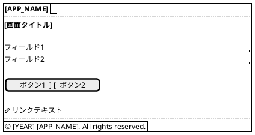

# [PROJECT_NAME] - ワイヤーフレーム仕様

**Feature ID:** [FEATURE_ID]  
**Version:** 1.0.0  
**Last Updated:** [DATE]  
**Format:** PlantUML (draw.io インポート可能)

---

## 使用方法

### PlantUMLレンダリング
各ワイヤーフレームは PlantUML の `salt` 記法で記述されています。

**レンダリング方法：**
1. [PlantUML Online Editor](https://www.plantuml.com/plantuml/uml/)
2. VS Code PlantUML拡張機能
3. draw.io（File → Import → PlantUML）

### draw.ioへのインポート
```
1. draw.ioを開く
2. File → Import from → Text
3. 以下のPlantUMLコードをコピー＆ペースト
4. 必要に応じて編集
```

---

## 画面一覧

1. [画面名1 (file1.html)](#1-画面名1)
2. [画面名2 (file2.html)](#2-画面名2)
3. [画面名3 (file3.html)](#3-画面名3)

---

## 1. 画面名1

**ファイル名:** `[FILENAME]`  
**目的:** [画面の目的]

### PlantUML



### レイアウト説明

| エリア | コンポーネント | 説明 |
|--------|--------------|------|
| ヘッダー | [COMPONENT] | [DESCRIPTION] |
| メインコンテンツ | [COMPONENT] | [DESCRIPTION] |
| フッター | [COMPONENT] | [DESCRIPTION] |

### バリデーション

- フィールド1：[検証ルール]
- フィールド2：[検証ルール]

### 画面遷移

| アクション | 遷移先 | 条件 |
|----------|--------|------|
| [ACTION] | [TARGET_SCREEN] | [CONDITION] |
| [ACTION] | [TARGET_SCREEN] | [CONDITION] |

---

## 2. 画面名2

[必要に応じて画面を追加]

---

## 3. 共通コンポーネント

### 3.1 ヘッダー

```plantuml
@startsalt
{+
  {/ <b>[APP_NAME]</b> | <&account-login> [USER_NAME] | <&power-standby> ログアウト }
}
@endsalt
```



### 3.2 ナビゲーションメニュー

```plantuml
@startsalt
{
  [メニュー1] | [メニュー2] | [メニュー3]
}
@endsalt
```



### 3.3 フッター

```plantuml
@startsalt
{+
  {/ © [YEAR] [APP_NAME]. All rights reserved. }
}
@endsalt
```



---

## 4. レスポンシブデザイン

### 4.1 デスクトップ (> 1024px)

[デスクトップレイアウトの説明]

### 4.2 タブレット (768px - 1024px)

[タブレットレイアウトの説明]

### 4.3 モバイル (< 768px)

[モバイルレイアウトの説明]

---

## 5. スタイルガイド

### 5.1 カラーパレット

| 用途 | カラーコード | 説明 |
|------|-----------|------|
| プライマリ | #[XXXXXX] | [説明] |
| セカンダリ | #[XXXXXX] | [説明] |
| アクセント | #[XXXXXX] | [説明] |
| エラー | #[XXXXXX] | [説明] |

### 5.2 タイポグラフィ

| 要素 | フォント | サイズ | 太さ |
|------|---------|--------|------|
| 見出し1 | [FONT] | [SIZE] | [WEIGHT] |
| 見出し2 | [FONT] | [SIZE] | [WEIGHT] |
| 本文 | [FONT] | [SIZE] | [WEIGHT] |

---

## 6. 改訂履歴

| バージョン | 日付 | 作成者 | 変更内容 |
|-----------|------|--------|---------|
| 1.0.0 | [DATE] | [AUTHOR] | ワイヤーフレームを新規作成 |

---

**ドキュメント終了**

*このワイヤーフレーム仕様は、UI設計とレイアウトを記述しています。機能詳細は functional-design.md、画面遷移は functional-design.md の画面遷移セクションを参照してください。*

